# 厨卫工程

厨卫工程可分为两部分：一是瓦工工程，包括做防水、做泄水破、贴砖等；一是设备工程，就是橱柜加点器、卫浴马桶、洗手台、浴缸与淋浴花洒等。

卫浴工程比厨房工程复杂许多，尤其是要“创造”新卫浴或位移。里头会牵涉到移动管线、垫高地板以及防水等问题。新卫浴应该离管线越近越好，因为管线拉太远，代表地板要垫得越高，会加重大楼地板的承重能力。而多数瓦工师傅并不懂建筑结构，到时问题可能会很多。所以，绝对不是师傅说管线拉多远，就拉多远。

point1：厨房卫浴，不可不知的事
[重点1]卫生间吊顶有两种选择
[重点2]重拉管线的5大要素
[重点3]隔墙最好用砖墙
[重点4]别忘记用玻璃胶收边
[重点5]卫生间门选择防潮湿材质
[重点6]卫浴设备高度要测试
[重点7]厨房灯光要明亮
[重点8]厨房电器柜要先量好尺寸
[重点9]炒菜的工具全要靠近炉灶
[重点10]加升降式五金篮更便利
[重点11]零碎空间可塞入抽拉柜
[重点12]三合一阳台门通风又采光
[重点13]拉篮代替抽屉更省钱
[重点14]加个收纳刀叉的抽屉
[重点15]厨房拉门可防油烟散逸
[重点16]要留维修孔

point2：容易发生的7大厨卫纠纷

1. 最抱歉！卫生间防水没做好，楼上洗澡楼下下雨

#### 卫浴怕漏水，防水做几层才安心

卫生间防水层的高度最好从地板到吊顶，最好也要180cm高。

卫生间壁地面都要做防水，通常会从卫生间壁面先做，再做地板   !!!重要!!!

防水层怎么做，去逛一下卖防水材料的官网，都有好几千字，非常详尽的解释，我们来谈最不容易做到的部分。

一、基底层要平，要够干净

基底层要干净，水泥砂浆打底的附着力才会好，但就是有师傅懒得清土块，砂石。另外若要敲除原地板，基底层会很不平，就得先水泥粗胚打底，并且把泄水破做好。之后等水泥干，再上防水层。若水泥地板不是太粗糙，也可不必打底，直接上防水层。

二、防水浆料要“薄涂多层”，等干透才能进行下一道

防水层就是涂刷防水浆料，地避免都要抹2\~3次。但也不是越多层越厚越好，姥姥就曾听设计师说：“我们防水做得很扎实，做7层以上，所以收费比较贵。”听他在乱盖。因为防水浆料做太厚，表层与里头的水分散发速率不同，反而易裂，当然不是好事。

防水材一定要“薄涂多层”，也就是一次均匀涂薄薄一层，分多次涂，因为薄，才能干透。防水浆料是需要干透后，才能形成“膜”来防水。每次涂的方向要相反，一个是直涂，另一道就要横涂。

在地漏、套管、卫生洁具根部、阴阳角等部位，可再加强涂刷，但之前水泥砂浆在根部要先做圆角，才好上防水材。在涂刷防水浆时，若流到阴角也咬刮除，以免积太厚而开裂。   !!!重要!!!

但问题来了，怎样叫“干”？许多师傅的看法不一，一般认为是手摸不黏，不剥落即可。不过姥姥查到K11防水工法，厂家认为，“必须在地板行走时不会破坏表膜”。

以手摸不黏来看，通常得等2\~4小时（看天气），许多师傅不愿等，以表面凝固当基准，这是不对的，因为防水膜若没有干，膜就不易成型，日后漏水几率会较高。

三、防水浆料涂完后，养护3\~7天才能贴砖

常见的防水材料有两种材质：树脂型和硅酸质型。树脂型要干燥养护，但记得“千万别用电吹扇吹”！！！  !!!重要!!!

硅酸质的防水材则要“喷水”养护，这很重要，这材质是要有水才会结晶，时间越长结晶越密，填缝就越完整。

除了卫生间，一般还会做防水的还有后阳台，那厨房、客厅和餐厅要不要做防水呢？这就看个人选择了，大部分都没做。

防水层一年以内为佳。

做完防水浆料后，可在墙角四周加强涂布，增强防水力。

#### 血泪领悟

    1. 防水浆料要擦2\~3次，每次都要等前次干了再擦
    2. 做好防水层后，要养护数日，才能贴砖。
    3. 贴砖前要蓄水试验，测试是否漏水

2. 最无语！填缝太赶，白的变黑的

#### 瓷砖填缝，要等24小时

为什么瓷砖一定要填缝？主要是因为砖与砖之间的缝隙底材是水泥，水泥毛细孔大，最容易藏污纳垢，也会吸水，容易发霉；涂上填缝剂后，就不容易发生以上的事。

填缝后，要立刻擦拭多出来的粉，不然干了就擦不掉了。而且会造成瓷砖边界被吃（覆盖）掉。

另一个，师傅在施工时手或者鞋子不干净，弄脏了填缝处，造成缝隙还没使用就黑黑灰灰的。这个提前交代好，尽量避免。

#### 至少24小时候才能填缝

填缝剂容易出问题的地方不是材料，而是师傅的细心度与“时间”。

“理论上”要瓷砖贴好后48小时再填缝，好让砖墙内的水汽散出散干，不然一填下去把水汽封在里头，日后填缝或瓷砖可能会因水汽变色，变得有点黄黄脏脏。

填缝剂很便宜，每公斤11元到20元，加防水防霉的贵一点，20到30元。

#### 填缝剂可选色，耐脏污最优

填缝后隔天要做保护，不让其被弄脏。所以，建议能不用白色就不用白色，尤其是地面，可选灰色系或带颜色的，较不容易看出脏，当然还是以搭配砖色和个人喜好为前提。

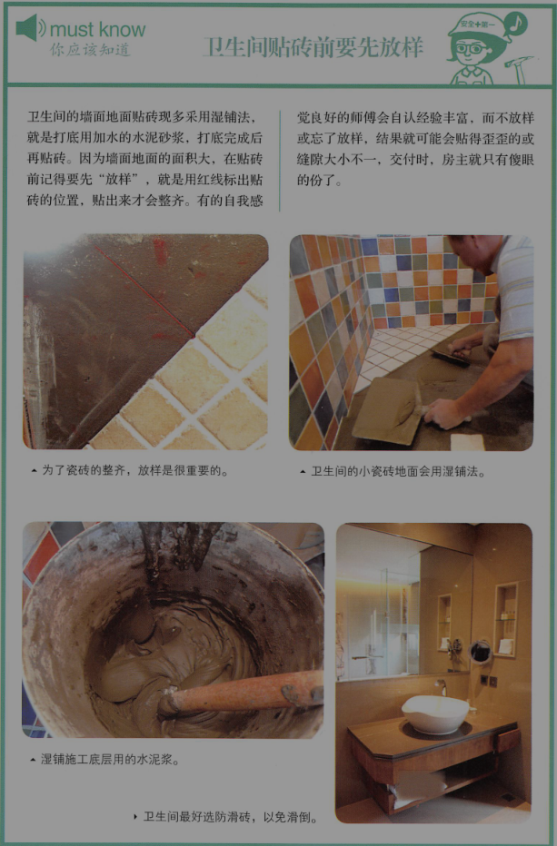

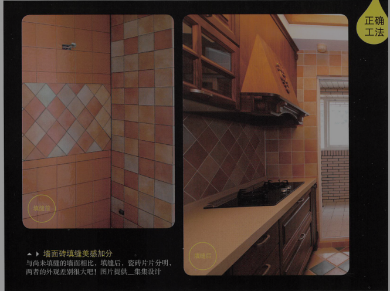

最后要说的是，美缝也可以自己做。

#### 血泪领悟

    1. 贴完瓷砖后，最好过24小时以上再填缝
    2. 先跟师傅讲好，不希望验收时看到砖的四周被填缝剂淹没，师傅就会好好擦拭
    3. 白色填缝剂容易脏，可选灰色或其他颜色

3. 最潮湿！卫生间门槛没做好，水渗入卧室木地板

#### 卫生间要做止水墩，门槛要选“冂”字型[jiōng]

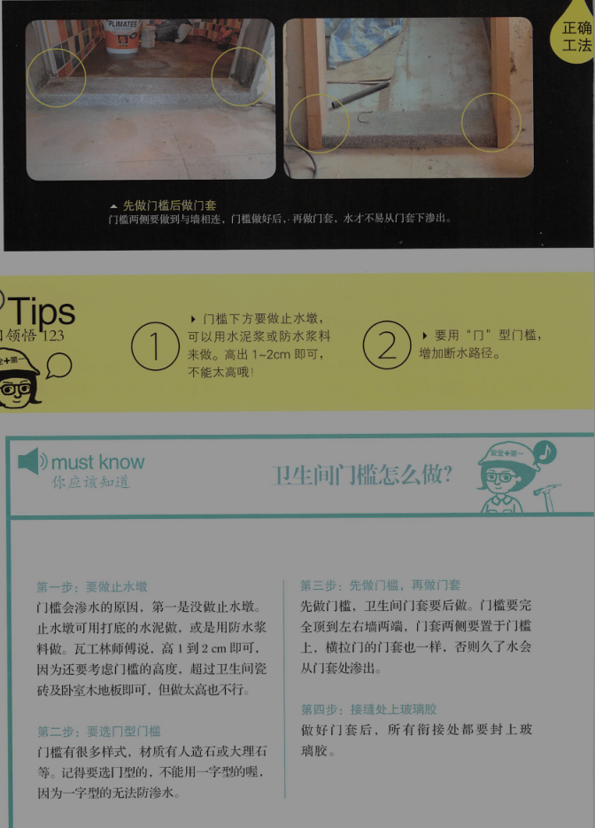

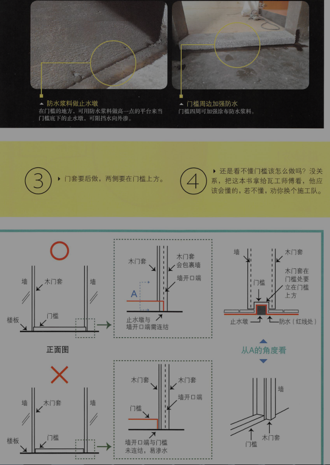

4. 最操劳！做了泄水坡，仍要扫积水

卫生间设有淋浴间时，淋浴间的内外都要做泄水坡。

小尺寸的马赛克砖因缝隙多，泄水较快，较不易积水。

做了泄水破还积水的原因：贴工不好，向着地漏的方向倾斜，有的师傅会弄反；还有就是砖本身的问题，中间低四周高。

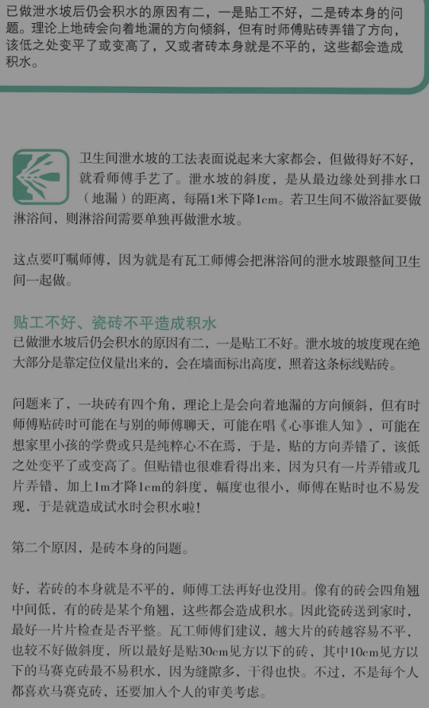

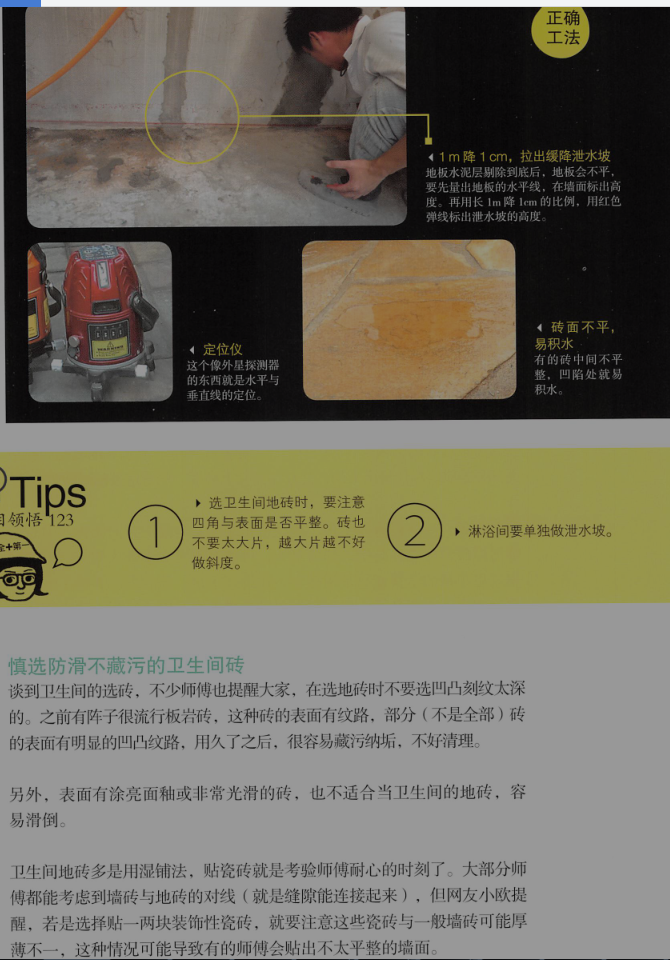

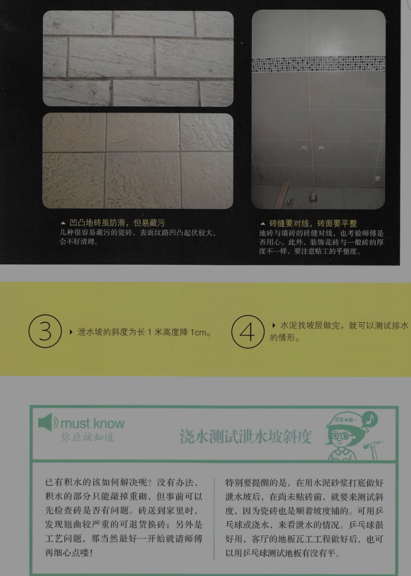

卫生间的选砖，最好不要选凹凸刻纹太深的，用久了容易藏污纳垢。

#### 血泪领悟

    1. 选卫生间地砖时，要注意四角与表面是否平整，砖也不要太大片，越大片越不好做斜度。
    2. 淋浴间要单独做泄水破。
    3. 泄水坡的斜度为长1米高度下降1cm。
    3. 水泥找坡层做完，就可以测试排水的情形。

5. 最不便！地漏设在“狭路”中，很不好清理

#### 卫生间地漏，定位错误问题多

地漏的位置比我们想的要自由得多，当然，不要距门太近，我们要让卫生间的最低点远离卧室的木地板，但也不能在容易被踩到的地方，因为赤脚踩着地漏感觉并不好。

通常可以放在“四周无阻的宽阔地点”，如洗手台附近，细柜下方。而不是马桶和浴缸之间。

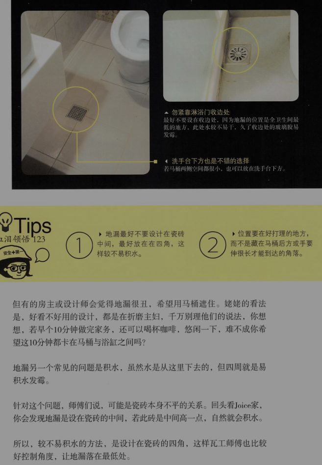

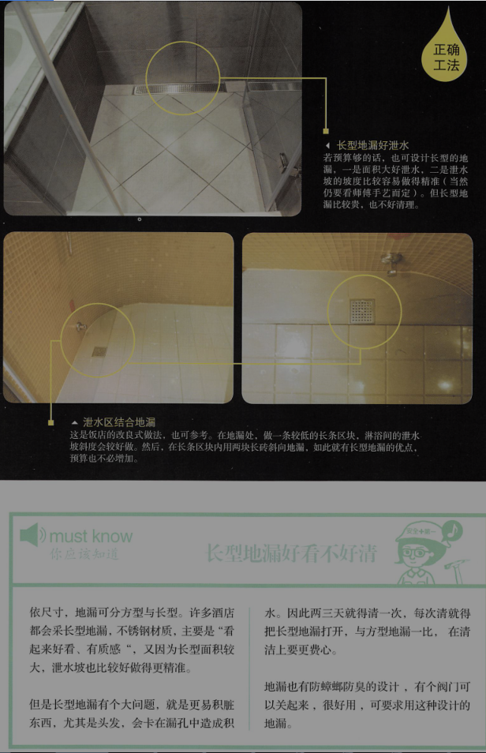

6. 最犹豫！用浴缸好还是淋浴好

7. 卫浴，你应该注意的事

卫浴是一个比较独立的工程，虽然是小小的几平米空间，工种却很多，包括拆除、水电、瓦工、设备等，若你家没有大装修，只要更新卫浴，也可以直接找卫浴设备公司。

卫浴工种多，相对工法也复杂，除了前几篇中提到容易出问题的地方，还有6大工法要注意。

+ 重点1：吊顶的2中选择

吊顶的传统材质都用PVC，但有的人觉得不好看，现在用铝扣板的也很多，PVC的好处就是费用较低。也好打理，但质感较差。

铝扣板表面有金属光泽，质感较好，看起来美观。价格1平米约100元，表面有各种花色可选，也好清理，不易发霉。

铝扣板很轻很薄，固定结构为轻钢龙骨，卫生间湿气重，最好选有加防锈处理的龙骨。钉龙骨时，主吊杆水平要捉好，吊顶平面才平整；另外灯具或浴霸的地方，龙骨四周要加吊杆和安置配件，增强支撑力。

不管用哪个，记得要涉及维修孔，日后找漏或要加什么最新科技的电器，就比较方便。

+ 重点2：重拉管线的5大要素（卫生间或马桶移位，管线要同步移位）

    + 旧排粪管多埋在大楼地板汇中，所以重拉排粪管时，多采用垫高地板的方式，以免打穿大楼地板或切到钢筋。
    + 新马桶端到管道间斜度要够，管径75mm以上者为1/100（就是100cm长度要下降1cm高度）；75mm以下者为1/50。
    + 新移位的管线越近管线出口越好，若管线拉太远，则地板要垫得更高，这是原大楼地板的承重力是否足够，要仔细估算。绝对不是水电师傅说管线能拉多远就拉多远哦。
    + 排粪管最好能走直线就走直线，不要转弯，只要多个弯，阻塞的概率就会高许多。
    + 若增设的两个马桶举例太近，而且又接到同一排污管，A马桶冲水时对B马桶的水常会跟着走动。所以建议，可在马桶粪管后接个排气管，延伸到管线间，就可以解决连动问题。  !!!重要!!!

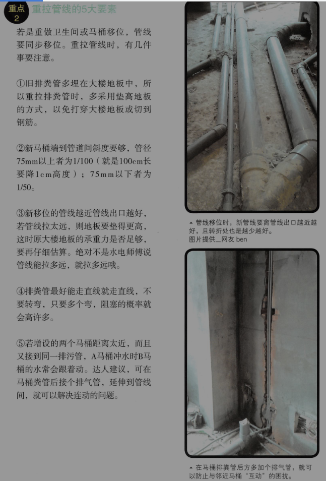

+ 隔墙承重力要够

若是重做卫生间，隔墙也要重砌。因卫浴设备不少都是挂壁式的，砖墙承重力较佳，隔音效果也好，但易发生壁癌，重量也较大，对建筑安全保护较差。若选择轻钢架墙体，则板材要选抗水石膏板或水泥板为佳，设备的位置也要装置安装配件。

+ 别忘记用玻璃胶收边

所以柜体、洗手台、浴缸、门套、马桶等，与地面、墙面接触的地方，都要打玻璃胶收边，以免水从缝隙渗入。绝大并不是每个师傅都能好好用玻璃胶封好卫生间的，所以验收时要好好检查。

材质上，**要选卫生间专用，防霉能力强的玻璃胶**。玻璃胶变黑，这一块那一块，洗不掉，刷不掉，那就是发霉了。

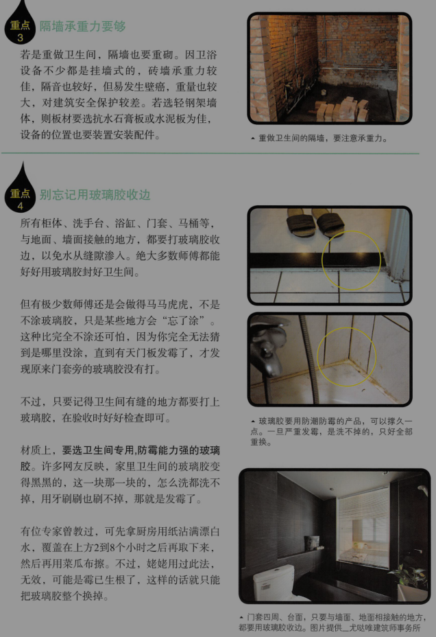

+ 卫生间门选择防潮湿材质

卫生间门现在多采用塑钢门，塑钢门的防水能力较佳。但有时为了美观考量，设计师会做木门。木门最好是用在干湿分离的卫生间，不然用久了木门易发霉，最好再在门下方留个百叶设计，以便湿气散出。

+ 卫浴设备高度要测试

洗手台、淋浴花洒喷头等离地面多高，要考虑房主身高与生活习惯，使用才顺手。最好在师傅定好位置后，先在墙上做一个标记，你自己再实地测试一下，就知道好不好用了。

#### 装修卫浴要注意的坑

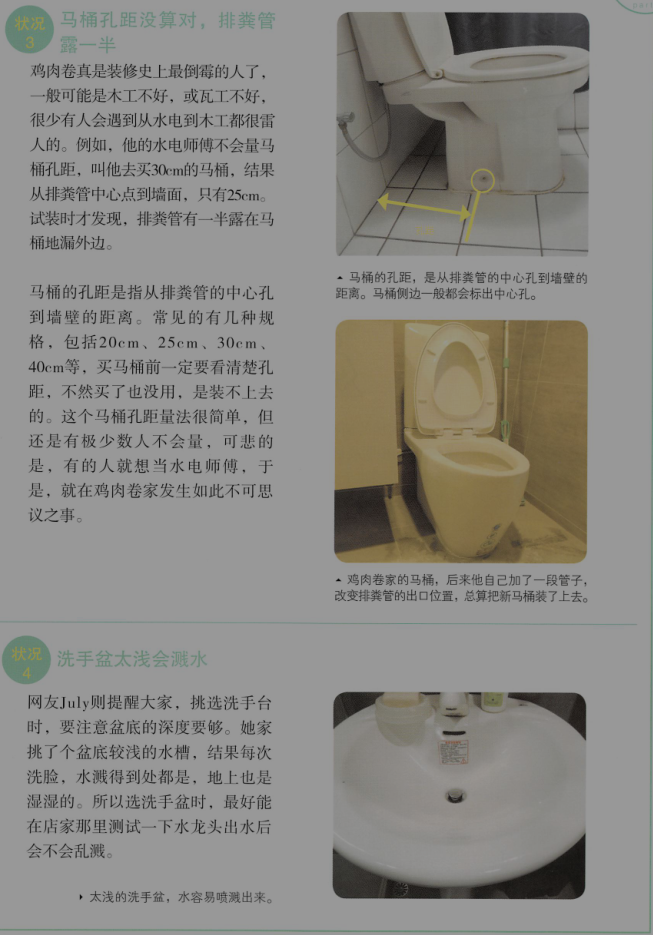

[状况1]一开龙头，水管三角阀就漏水

[状况2]瓷砖出水口切孔过大、过歪

[状况3]马桶孔距没算错，排粪管露一半

水电师傅不会量马桶距离，就直接叫买30cm的马桶，结果买来才发现只有25cm，排粪管一半露在外面。

马桶的孔距是指从排粪管的中心孔到墙壁的距离。常见的有几种规格，20cm，25cm，30cm，40cm等，买马桶前一定要看清楚孔距！！！

[状况4]洗手盆太浅会溅水

买之前最好能试一试水花。

8. 最酸痛！消毒碗柜装太高，天天手酸脖子疼

#### 厨房设备台面多高？要看你的身高

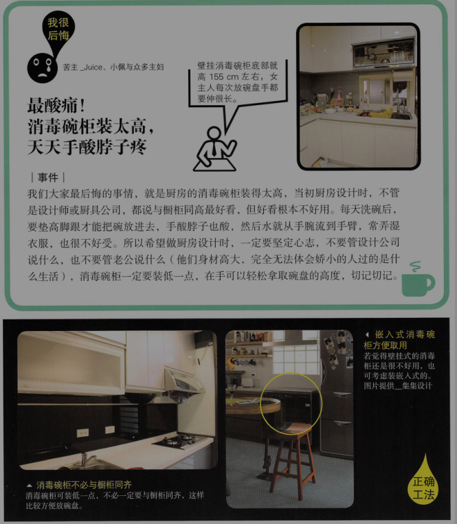

消毒碗柜，安装的高度（机身的底部）最好比自己的身高低15cm左右，如身高155cm，那机身底部就可安在140cm的高度。当然你自己还要试一试方不方便。

#### 厨房，你该注意的事

[重点1]灯光要明亮

[重点2]电器柜要先量好尺寸

电器柜可以放电饭锅、微波炉、烤箱等，要记得厨房电器先量好尺寸，以免电器柜设计得太小。

[重点3]炒菜的工具全要靠近炉灶

[重点4]加升降式五金篮更便利

[重点5]零碎空间可塞入抽拉柜

[重点6]三合一阳台门通风又采光

[重点7]拉篮代替抽屉更省钱

[重点8]加个收纳刀叉的抽屉

[重点9]拉门可防油烟逸散

[重点10]要留维修孔

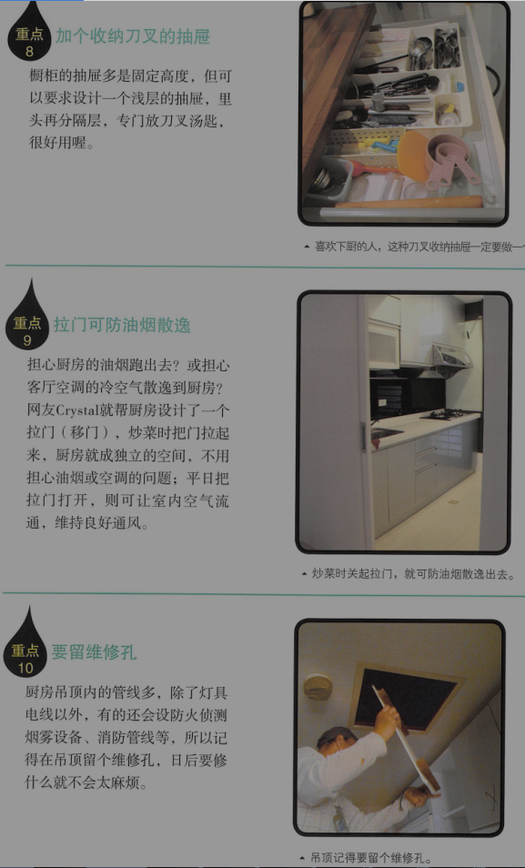

#### 会出问题的厨房问题

[状况1]台面还没使用就受伤

[状况2]炒菜老是踩到地漏

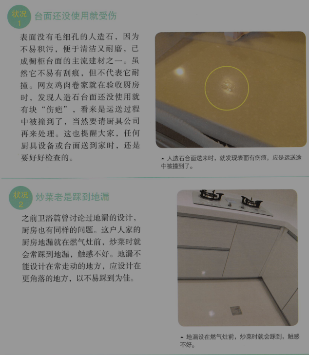

[状况3]燃气灶太靠近墙壁，无法炒菜

[状况4]冰箱被放入窄巷中，不好开

point3：厨卫工程估价单范例

