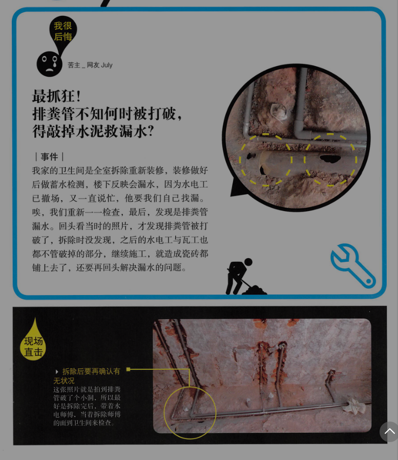
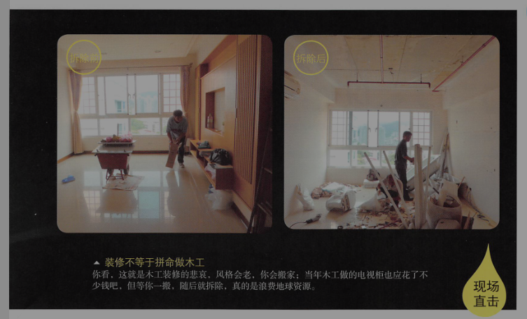
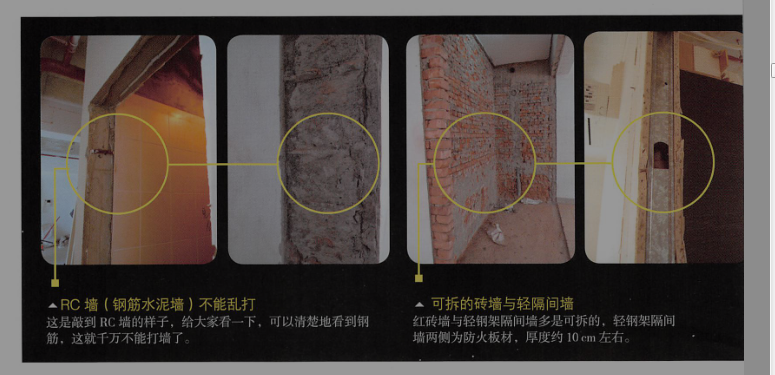
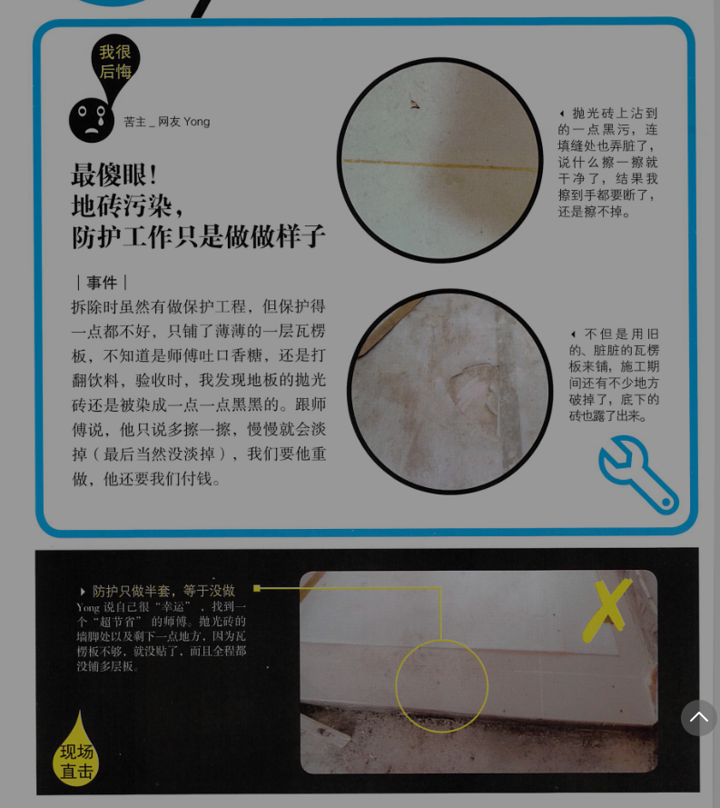
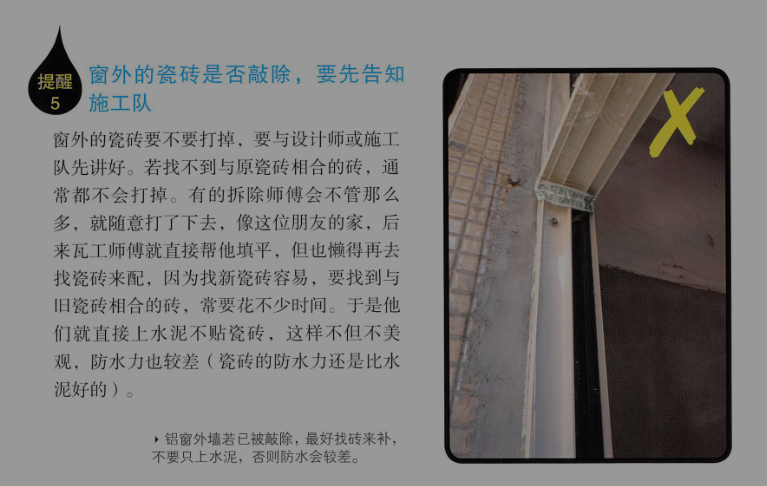

# 拆除工程

在拆除之前，一定要先想好家里的格局，不能操之过急，不然容易白做工。

另外，拆前也要多想想有没有什么东西可以再利用的，如柜子内部都还好好的，只有柜门旧了不符合风格，就可以不拆柜身，既省钱，又不会制造无谓的垃圾。

point1：拆除，不可不知的事

[提醒1]请先断水断电断煤气
[提醒2]检查漏水
[提醒3]检查有没有蛀虫
[提醒4]窗框拆除，内角水泥层一起敲
[提醒5]窗外的瓷砖是否敲除，得先告知施工队
[提醒6]拆窗后，要用帆布封窗
[提醒7]消防管线、洒水喷头不能移位或拆除

point2：容易发生的4大拆除纠纷

1. 最抓狂！排粪管不知何时被打破，得敲掉水泥救漏水？

讲好“全室换管”
，别以为就是“全部换”！热水管，冷水管，排粪管。师傅会跟你说，“一般”都是不换排粪管的，所以想换排粪管，要特别跟水电师傅说，若不换，则要叮嘱，拆除时小心别敲破排粪管。

拆除师傅敲破后也不讲，然后水电工与瓦工也不看，就 封起来了，后来做蓄水检测时，楼下反映漏水，这时候就晚了。后来与师傅协商，没人承认错误；拆除师傅说不是他们打破的，水电师傅也说不是他们打破的，最后从照片分析，水电师傅在装洗手台的水管时，就“应该”看到了，却没有发现，所以决定由水电师傅来补。

水电师傅不想再动大工程，就用软管塞进粪管中来补救。但这种软管易破，日后若想通马桶，不能用高压棒，不然，软管破了，再漏水的机率很高。

因此拆除做完后，要带着水电师傅，当着拆除师傅的面到卫生间来检查，若水电师傅当场都说OK，日后有问题，水电师傅就要抗责任了。 !!!重要!!!

#### 血泪领悟

    1. 排粪管换不换，要先想清楚，然后拆除，水电和瓦工师傅三方都要知道。
    2. 有状况要与施工队沟通，一定要找到施工队长。
    3. 每个施工队交接时，要带接手的施工队一起检查，如拆除师傅撤场时，可带水电与瓦工师傅一起检查，这样打破水管或者没有敲好地板，责任就都有人扛了。
    4. 看工地时，就当在看观光景点，能拍照就拍照，每个房间和细节都拍，日后要检讨工法时，说不定能派上用场。

2. 最揪心！白拆了的瓷砖地，白付了一笔钱

拆除后会有大量垃圾要清运，在拆除前，可先问问大楼管委会或者附近邻居，大型垃圾可以放在哪个地点，以及清运车可以停在哪里，以免到时被赶来赶去，甚至被罚。

要考量电梯的高度，拆下的门是否进得去；砂石要打包好，不然边运边漏砂，会引来邻居抗议。

记得最后一台清运车离开前，再看一遍家里是否该拆的都拆完了，有些小地方易遗漏，如对讲机，门框，踢脚线等。

#### 血泪领悟

    1. 铺多层复合或者强化复合木地板，原本瓷砖地板只要够平整，可不比拆除；弹药视现场情况而定，若有瓷砖起鼓变形，仍要拆除。
    2. 地板要不要拆除见底，要看铺什么类型的地砖，以及要考量新大门的门槛高度。
    3. 跟施工队沟通，要知道的是不同做法会有什么不同的结果，而不是你说什么他就做什么。

3. 最心烦！听信施工队与设计师，阳台外扩惹麻烦

剪力墙，RC墙（钢筋水泥墙）等结构墙都是不能拆除的，一般厚达15cm以上，内有钢筋。

可以拆的墙多为砖墙或轻钢墙。砖墙敲除表层后，会看到红砖，厚度约12cm；轻钢墙则会看到前后的石膏板等钢材，厚度约10cm。

#### 血泪领悟

    1. 只要是阳台外扩，包括拆掉落地窗旁的两侧墙面一般都是不允许的，不过可以尝试跟物业确认。
    2. 若设计师或者施工队说可以外扩，请他们签责任书，以免日后反咬你一口。

4. 最傻眼！地砖污染，防护工作只做做样子

地板，要保留的大门，室内门，柜子都要包好，以免在施工和搬运建材时不小心收到撞击而损坏。卫生间则除了要注意地板和浴缸的覆盖外，还要用胶带封住水管，以免细碎的砂土不知不觉间渗进去，造成日后处理的麻烦。

point3：拆除工程估价单范例

5. 拆除，你应该注意的事

拆除前、中、后，都有些该注意的事，例如要先断水断电以保安全，再来，可趁干扰视线的杂物或木墙等障碍清除后，好好检视一些平常不见天日的角落有没有壁癌或漏水。至于哪些该拆哪些不能拆，最好在现场交代清除，建议再用纸写下来，因为不是每个工长都记性良好。

拆除的工期长短不一，以100平米的老房子全屋拆除为例，有的工长一次派5\~8人，一上午就拆完了；如果是2\~4人，慢慢悠悠，就得拆个2\~3天。所以要问清楚，以免你到现场时，该拆的不该拆的都拆完了。

+ 提醒1：先断水断电断煤气
断水是关水表总开关，断电是关总开关箱，断煤气则是把总开关关起来。若要改煤气管线，要与煤气公司联系。

+ 检查漏水

漏水分为两种

一种是明目张胆出现在你眼前，常在墙角，以壁癌的样子呈现；另外在卫生间周围的墙壁以及会直接淋到雨的外墙，都较易漏水。

第二种是隐蔽式的，藏在地板或者木墙内。例如，当地板敲掉瓷砖时，水泥地是湿湿的，就可能是水管破裂，但也可能是由外墙渗透进来的；还有当木墙或吊顶拆掉后，才发现原来里头的墙早已面目全非，爬满壁癌。

遇到漏水要立刻处理，且须在瓦工师傅施工前把漏水源头找出来，不然，水泥封底后，还得再挖开来，费钱费心。找漏一定要找到漏水源头，比如壁癌，如果是因为水管渗水造成的，就得先把水管修好，不能只把墙壁表层清除掉后直接涂上防水漆。如果源头没有解决，日后还是会产生壁癌。

+ 检查有没有蛀虫

踢脚线内或者木柜内有粉末或者细木屑的话，就是可能遭蛀虫了。

+ 窗框拆除，内角水泥层一起敲

+ 窗外的瓷砖是否敲除，得先告知施工队

+ 拆窗后，要用帆布封窗

+ 消防管线、洒水喷头不能移位或拆除

