# 水电工程

拆除完成后，接下来就是水电进场。

包括换冷热水管，重新配电线回路，整理配电箱等，也是各工程中最常被偷工减料的一环。因为电线、配电管、灯泡等，都藏在天花板中，做完验收时看不到，设计师也不见得懂，所以会出现某些不良施工队在里头鱼目混珠的情况。

要避免这样的问题，首先，材料进场时的监工是绝对必要的；此外，要特别提醒大家，水电的预算千万不要省，因为豪宅级的做法也不过多个几百元，支付合理的费用，可让整个家住的更安心。

point1：水电，不可不知的事
[提醒1]弱点箱以方便维修为上
[提醒2]玄关可安装感应灯
[提醒3]进水管安装止水阀
[提醒4]吊架悬挂水管，不必再敲地板

point2：容易发生的9大水电问题

1. 最气结！漏电断路器被掉包

### 不想被糊弄，得先认识配电箱

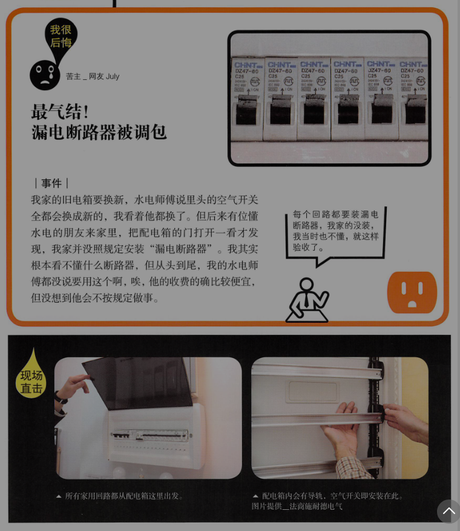

配电设计是整个家里最最重要的工程，但多数人却不太在乎。房子美轮美奂，但是电线全是黑心货，用电回路也不足，整间房子就像绣花枕头。真的建议大家多花点预算给水电工程，只有多个500元（需考虑通胀，现在可能不是这个价格），你会换回更多的“安心”，是值得的。

#### 带你摆脱危险——空气开关

别名很多，微型断路器、微型断路器，小型断路器都是它，英文简称MCB（Miniature Circuit Breaker）。主要功能是电线短路或用电量超载时，它会“跳闸”，可以保护我们免于电线走火。空气开关要选有安全认证的“CCC”产品，一定要指定品牌，以免用了次级品。因为一个16A的空气开关价格可差5至10元，有些人砍水电的费用砍得多了，师傅们就从这些材料省点钱。

#### 近水处保护你——装漏电断路器

漏电断路器有不同的规格，现多用二合一型（RCBO，漏电加短路过载保护合一），当测到漏电时，就会跳掉。配电箱中，最常见的问题就是：分路回路没有装漏电断路器。

关于家装电气设计，《民用建筑电气设计规范JGJ16-2008》第7.7.10条规定，“家用电器回路与插座回路”，要装漏电断路器，而家装回路不是给电器用就是给插座用，所以结论就变成每个回路都要装漏电断路器。

国家都有规定，但是上有政策下有对策，我手上的配电箱方案中，没有一个照规定做的。为什么不装？就是水电师傅想省点钱。一个漏电断路器16A1P的要60\~120元，但同规格的空气开关约12\~24元。因此该装漏电断路器的地方就用空气开关代替了。


两兄弟长得也像，小心被调包。漏电断路器比空气开关大只，外壳上会注明英文RCBO或者中文漏电断路器（另一种漏电附件叫vigi），还会有一颗测试钮，建议每个月按一下，可测试漏电跳闸的功能是否完好。

但若真的预算有限，无法每个回路都装漏电断路器，姥姥建议至少有水的地方，如厨房、卫生间、工作阳台等处要装，电热水器、高功率洗烘衣机等用电器也要装，现在电器质量不一，假货也多，若真漏电了，你会感谢自己装了漏电断路器。


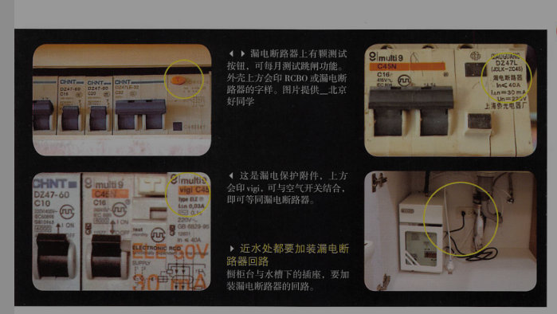


#### 血泪领悟

    1. 什么钱都可以省，什么装修都可以不做，但电的部分不要省，多个500元，你家更安全。
    2. 各回路都要安装漏电断路器，至少有水的地方，如卫生间，厨房等都要有

#### 漏电断路器不要装在总开关

一般漏电断路器要装在分路的回路上，也就是卫生间与厨房、阳台的回路，而不是装在总开关处。原因是跳闸时，若装在分回路，就可以从单一回路去找漏电的地方，若是装在总开关，就得在8个或者更多回路上一一去找哪里漏电。


2. 最无力！换了新电箱，但一样会跳闸

### 怎么又跳闸了？回路设计的8大基本概念


每间房子对于配电的需求各不相同，100平米的房子，配电箱多设为8P到10P（P为空气开关的单位），但大家发现了，许多东西是没算进去的，如浴霸等，若考虑未来可能要增加音响设备等电器的回路，大概会用到15\~20P。

+ 要先详列电器
列出所有的电器，才能回推你家需要多少回路，不用空想，尤其是厨房，高耗电的微波炉、烤箱、电磁炉、电热水器等，都有列出来。

+ 空调
通常是看室外机有几台，就用几个专用回路，如一台分体式1托2的空调，因室外机是一台，所以就配一个专用回路。

+灯具
全室灯具可用1个回路包办，最好单独一个回路，有的会与插座同回路，这样不好，若插座跳闸，等就不会亮，影响较大。灯具回路通常用1.5平方电线，法定可承受电流是14.5A，若家中的灯具太多，电线可配2.5平方，此部分可请水电师傅评估。

+ 卫生间插座
插座就比较复杂了，要分几个区域讨论。首先就是卫生间，因湿气重，所以插座、灯具与暖风型3和1浴霸可共享1个“漏电”回路。所谓漏电回路，是指此回路要装漏电断路器（请一定要装）。若有电热水器，用电量超过12A，则要再多加1个漏电专用回路，不然若同在16A的回路中就易跳闸。

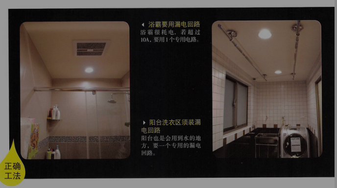

+ 厨房插座
小型电器都可合用1个回路，要注意的是，厨房有水，所以回路要装漏电断路器保护。

但若有大功率、高耗能的烤箱电器，则要另配1个专用回路给它用，不然容易跳闸；像越来越多人会用380V的电器，如蒸烤炉或国外大功率厨房电器（超过2500W），这些电器都不能使用220V的插座，再要另外安装400V插座或专用回路，才安全。

冰箱也可以考虑专用回路，若与其他厨房电器公用回路，只要跳闸，冰箱就停电了，冷藏食品会坏掉。

+ 阳台插座
阳台有洗衣机，也要1个漏电回路，若有安装洗烘机等大型耗电器具，也要再增设专用回路。

+ 客厅和三个房间的插座
基本上可用一个回路，主要是看用插座的家电用电量，一般小家电都不大，也不会同时使用，所以1个回路即可。但若插座数量太多，超过单一回路的承载电量，就得再多加一个回路。

+影音柜
你可能没钱弄一套百万音响，但若想让自家的千元音响也有好声音，只要给电视柜或影音设备一个专用回路，音质画质就会大大提升，这是花小钱提升质量的好方法。

#### 三室两厅回路运算实例 !!!重要!!!

易100平方米三室两厅的格局为例，实地算一下。但在进入实地演练之前，姥姥得先说明，因为各家电状况不同，范例只是示范，你还是要根据自身情况，找配电人员详细讨论。

解释一下总计的数字算法。家用配电箱最常用的就是单排导轨，大小尺寸单位为“位”，空气开关1P为1位。

照范例来看，“基本款”总开关箱的大小为，10P+总开关1x2P=12P(具体计算参看下表)，即要用12位以上大小的配电箱。

每间房子有不同的需求，现在一般配电箱多设定在8\~12位，但大家也发现了，许多东西都没算进去的（如大烤箱），若全部算入，或考虑为了所需的足够数量（如要增加音响设备的回路），大概会需要用到16位以上。

水电达人建议，8位与16位的两种配电箱价格，不过就差个几十块钱，在整个装修工程费中就是九牛一毛。整理电箱贵在人工费，所以不如一次就装大一点的电箱，日后就不必再花好几百来敲换或增设电箱了。


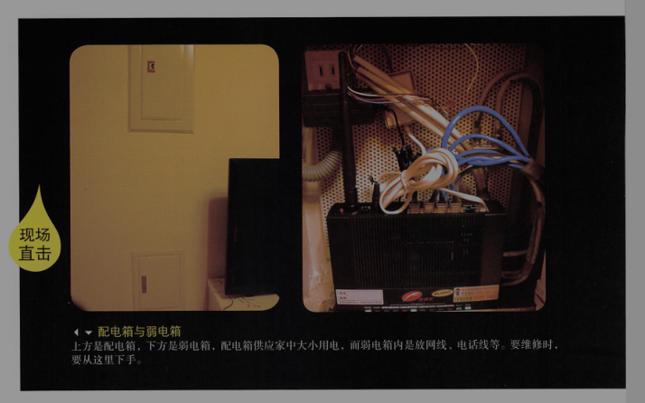

+ 地暖
地暖有分水暖或电暖，此处是指发热电缆的地暖，配几个回路要视使用功率大小而定。一般16A回路可承受功率3200W的电地暖，但可为了安全使用功率会减20%，所以是2816W，约是36平方米所需用量。若面积大于36平方米，最好再增设一回路。

好了，再看看July家500元换了新电箱，也增加了回路，但为什么电热水器加浴霸一起用，或再加上吹风机，超过电流量16A，就会跳闸了。


回路与专用回路的不同


3. 最不便！使用家电，还得错开时间搞宵禁

### 怎么又跳闸了（二）？单一回路的电量算法


#### 回路=电路上所有插座的用电量

电路中所有插座上“同时使用”的电器用电量总和，而总和不能超过电线能负荷的电流量。

一个回路电线在配电箱中会连接一个空气开关，打开你家的配电箱，看看泥头的空气开关是几安培的。

#### 安培=电流量单位

安培 A = 功率 W / 电压 V

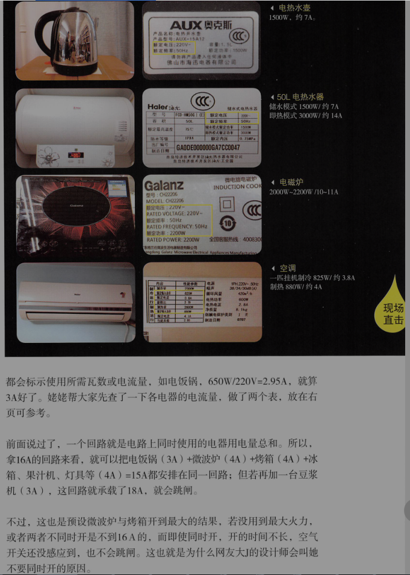

拿16A的回路来看，电饭锅3A + 微波炉4A + 烤箱4A + 冰箱，果汁机，灯具等4A = 15A都安排在同一回路，若再加一台豆浆机3A，这个回路就承载看18A，全=都同时开启就会跳闸。


#### 高耗电电器不要放在统一回路

在现实世界是一般厨房只设1个回路，对也没有装漏电断路器（唉，千万别省这点小钱）。所以，知道哪些电器会同时使用，这对规划回路很重要。原则就是高耗电的电器不要放在同一回路，要高低配，所以像大型微波炉及烤箱（小的就无妨），电磁炉最好分配在不同的回路中。

当然不会算的话，找一个专业的水电师傅帮你算。

#### 空气开关不是装越大越好

一般常见回路的空气开关是16A或20A，但常有房主怕跳闸，会要求空气开关装高安培25A或32A。其实这是错误的，空气开关跳闸时好的，是保护我们。

再来，空气开关若没有跟电线同步升级的话，装越大的安培数，反而越危险。

电器总电量 <= 空气开关（或漏电断路器） <= 电线

家用电线多是单一铜芯实心线。依据实心线的截面积大小又分为1.5、2.5、4、6平方等，不同大小的电线可承载的最大电量（简称载电流）也不同。但实际你搜到的厂家，1.5平方线，15A到19A都有人写，那到底是多少呢？

1.5平方线只能承载最大电流14.5A。

如果空气开关过大，就有可能电线都烧了，空气开关还没跳闸。

那家里的灯具、插座、空调回路等要用多少平方线配几A空开呢？

!!!重要!!!

若厨房插座回路，将电饭锅、微波炉、烤箱、冰箱、电热水壶等最大用电量加起来若是20A（插播一下，最常见的5孔插座载流量是10A，记得同插座电量不能超过10A哦），这时的两种做法：

```
方案A：用4平方线单一回路，因可承载26A，再配20或25A的漏电断路器
方案B：分成2个回路，用2.5平方线，每个可承载19.5A，漏电断路器搭16A。这个方案会比较好，对插座的保护比较高。
```

但要注意每一插座回路上的插座数量不宜超过10个；若是照明回路，电流不宜超过16A，光源数量不宜超过25个。

再来举例专用回路，如空调、地暖、电热水器或大功率电器。

像1.5匹以下的冷暖空调，最大用电量在制热，不到10A，就可接1.5平方线，搭10A的空气开关；若是3匹的柜机，制热会达25A，就需要装4平方线（26A），搭25A空开。但因为空调开的时间比较长，大人也建议电线可用粗一点的6平方（34A），空开用32A。 !!!重要!!!

不过，在现实世界中不少水电师傅都不会按照规范来配，有时就是会安装“高一点点”的安培数，像2.5平方线最常配20A。为什么呢？一是认为2.5平方线载流量大于19.5A，有厂家还写的是26A，虽然与国家规范不同，但我们可以选择相信或者不相信，相信的人，就可以用20A的用电器和相应的空开。

另一个因素是：只要跳闸，不但会被房主骂，也要再跑一趟维修。

#### 墙内电线最大承重电流量   !!!重要!!!

--- | --- | --- | ---
电线截面积 | 载流量 | 空气开关 | 常用回路
1.5平方 | 14.5A | 10A | 灯具
2.5平方 | 19.5A | 16A | 灯具，插座，厨房，卫生间，2匹以下空调，电热水器专用
4平方 | 26A | 25A | 专用回路为佳，如大功率电器，地暖，大二匹空调
6平方 | 34A | 32A | 专用回路为佳，如大功率电器，地暖，3匹以上空调

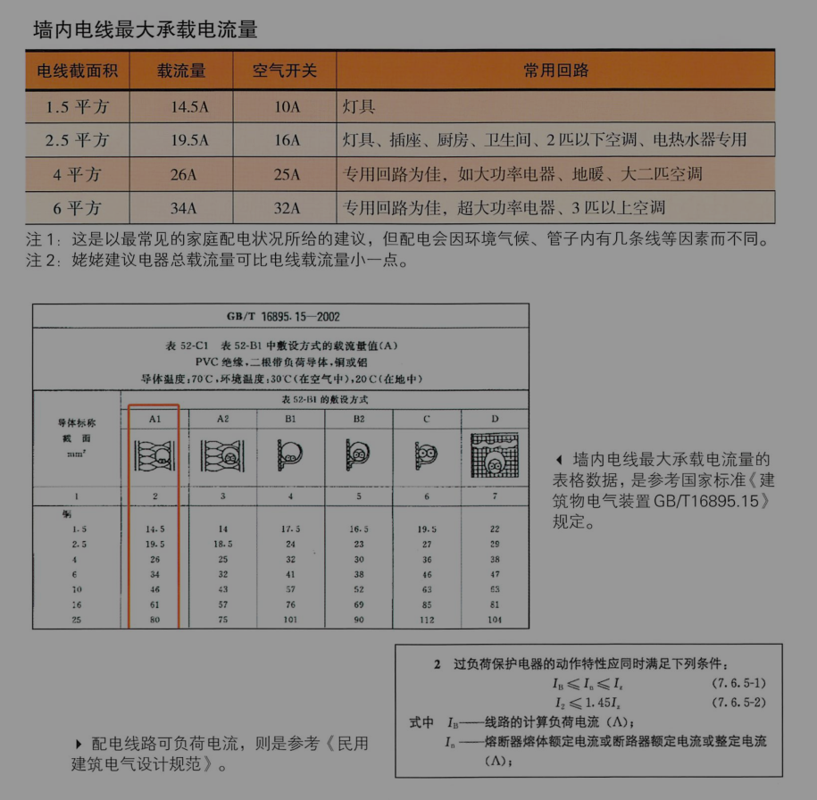


#### 血泪领悟

    1. 单一回路的用电量，就是电线上所有同时使用的电器电量总和。高耗电电器，如蒸烤炉，电热水壶、电磁炉等最好不要在同一回路。
    2. 插座单一回路插座数量不宜超过10个；是照明回路，电流不宜超过16A。
    3. 空气开关不是安培数越高越好。回路若用1.5平方线，空气开关以10A为佳；用2.5平方电线，空气开关以16A为佳，20A安全性会差一点点。

4. 最担心！小小电线大学问，配电不佳电线烧毁

#### 电线用了黑心货，超怕随时短路起火

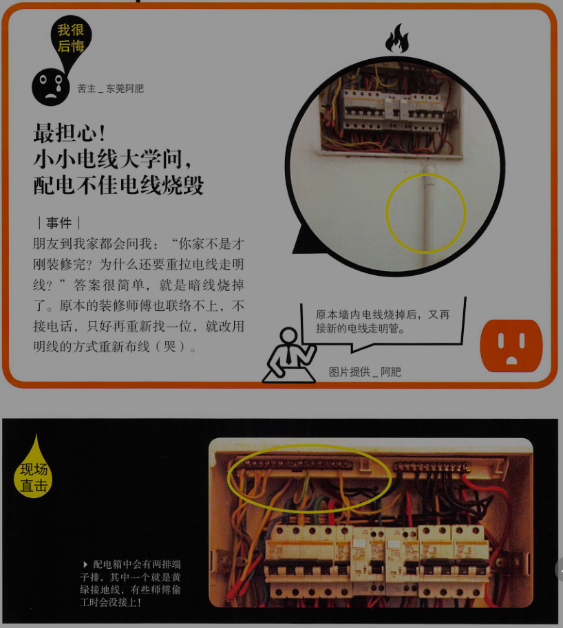

#### 制造年代要在3年内    !!!重要!!!

所以“有交代”要用合格的电线是很重要的。合格的电线上会印上检验认证“CCC”的字样，电线送到家时要看一下制造日期，最好使用3年以内的电线。电线绝缘皮的耐用年限约15\~20年，但就是有些人会买到库存电线，或者二手电线。

从颜色上看，电线有很多种颜色，是为了区分相线（火线），零线（中性线）与地线。但姥姥在找电线资料时，发现一个怪现象，各个厂家和设计公司说的都不一样。有的说，火线要用红线，有的说什么颜色都可以；零线也是一样，大家对用什么颜色看法不一。

还好我没由国家标准。

配电时，相线与零线的颜色应不同；同一住宅相线（L）颜色应统一，零线（N）宜用蓝色，保护线（PE）必须用黄绿双色线。

翻译一下就是：相线就是火线，没规定颜色，但全室要统一一个色（大部分是红色），不能红的黄的混用；零线最好用蓝色，因为是用了“宜”这个字，也没强迫性，但我建议就用蓝色；保护线就是地线，“必须”用黄绿双色线。

电线工法中另一个要注意的就是地线，因为最常被“省略”掉。在配电箱中，会有两排铜线，一个接零线一个接地线。接地线可让用电更安全，但有的师傅会偷懒，不接地线。结果就可能会触电，这要小心。    !!!重要!!!

#### 血泪领悟

    1. 电线上会印上检验认证“CCC”的字样，电线送到家时要看一下制造日期，最好使用3年以内的电线。
    2. 地线一定要接，保护线（PE）必须用黄绿双色线。
    3. 全室电线最好是火线红色，零线蓝色。
    3. 插座背后底盒，火线与L极相接，零线接N极，地线接中奖的接地极。


5. 最遥远！一延再延的插线板，我们一家都是线

#### 插座涉及乱糟糟，有时不够用，有时没有用


装修前，一定要找一个专业的水电师傅花个七天七夜一起商讨。这个电的部分，水电师傅比设计师重要，因为许多设计师不懂电，最好三位一起谈。

有的设计师会画出插座灯具图，那没有设计师的或是施工队没办法画出图的也不用担心，只要用粉笔，可以与水电师傅一起吧插座预先画在墙上，看看位置好不好用。

插线板接入并不会增加回路上的最大安培数，所以很多大功率用电器同时使用要注意用电上限。

怎么解决这个问题呢？

+ 列出你所以的电器，包括未来要用到的（插座和回路是同步设计的，所以这点是一样的），在水电工程进场前，就要和师傅讨论好。

+ 要安排好家具摆放的位置，尤其是电视和音响、电脑与周边设备等。因为插座的位置可藏在家具或电器后面，像烘碗机、饮水机、抽油烟机等后方，也可以规划在电器柜柜身里，这样放入烤箱、微波炉、电饭锅后，就看不到电线了。

厨房的电器插座现在多有厨具公司负责规划，但有的公司不懂插座设计原则，要提醒一下，橱柜台上的插座不用太靠近水槽或者煤气灶，水槽下净水机的插座也不要离水管太近，以免漏水时把插座泼湿。

插座的数量也不是数量多就能解决所有的问题，因为若回路没规划好，多插座就只是插线板的翻版，还是会跳闸。多插座仍要配合多回路的设计，但如何取得安全和实用美观的平衡，这门学问就叫“配电设计”，里头包含数学题与社会题，要精密计算与均衡分配，才能安全用电又方便。


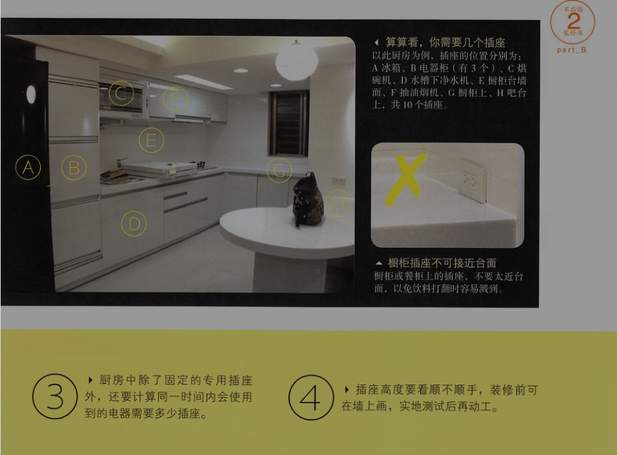


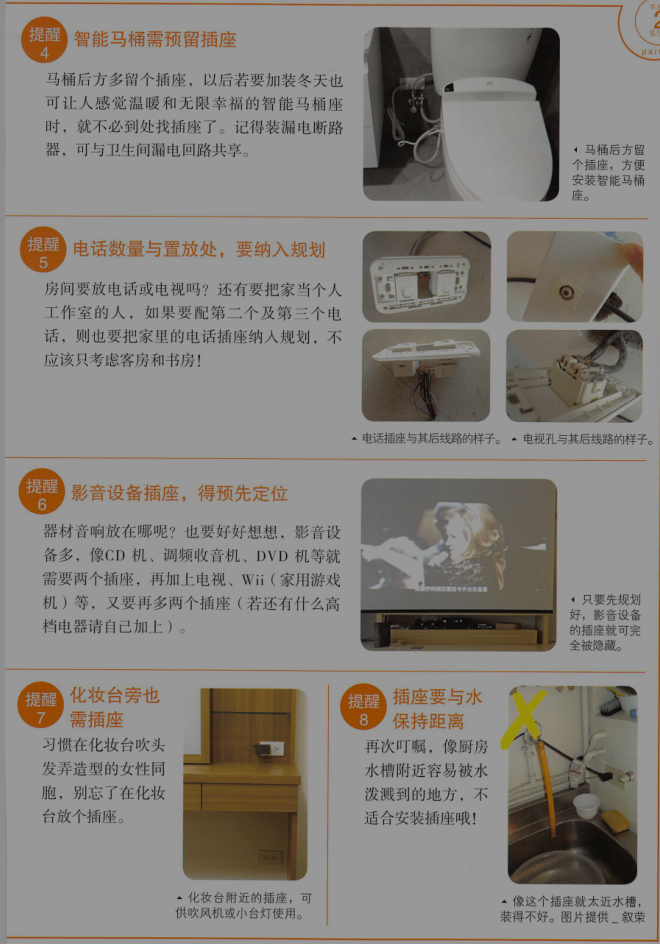


6. 最麻烦！卧室床头没开关，睡前还得再下床

#### 灯具开关不顺手，老是跑来跑去

##### 事件
我有找设计师，也画了设计图，但后来因工程费超出预算太多，就自己找施工队施工。我本以为设计图会把所有灯具开关标好位置，但施工后，发现卧室床头柜没有开关。关灯得下床去关。跟施工队沟通又说要加钱。好后悔。

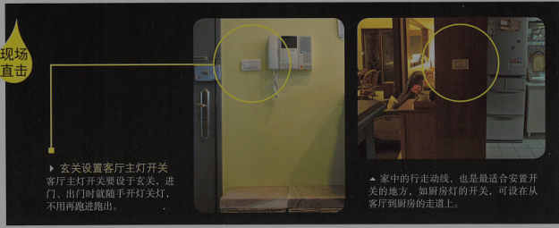

开关是装修中的再小不过的细节，设计图上设好开关位置后，可以先预演，试着把所有开关的位置画在墙上（一般开关离地140cm），然后走一圈，测试高度适不适合，顺不顺手，这个测试要在水电师傅进场前完成，这样才不需要再次更改施工。

把开关和插座放在卫生间镜子旁边，方便了吹风机，但是却带来了危险。

#### 五大空间，开关设计重点


    1. 玄关

    从进门开始，最常开哪个灯呢？不是玄关灯吧，而是客厅灯。所以，客厅的开关应在玄关处。另外玄关灯可以安个感应灯，大门一开灯就会自动亮。

    2. 客厅

    因为灯经常开来开去，可在动线上设置前后两个开关，采用双边控制，会更方便。若主灯有3段式灯光，可请施工队设为多段式开关（同一个开关根据按压次数不同来决定量多少盏灯）。吊顶嵌灯也可以做成分段式开关控制，一次开2\~4盏，有需要再全开，这样比较省电。   !!!重要!!!

    若有装电视灯，沙发附近最好也有电视灯的开关，而不是安装在电视那段，这样坐在沙发不用起身，就可以控制灯光。

    3. 卧室

    最好在床头与进门处都设开关，可双边控制。

    4. 卫生间
    一般房间或厨房、卫生间的开关，都是装在进门处，门外或门内皆可。但卫生间装在门外较佳，因湿气重，易生锈易触电。

    5. 楼梯
    在最上端与最下端都要装开关，双边控制。


7. 最糊弄！电线塞爆电管，走火几率高

#### 放断电闪屏，布线6大原则

电管内被赛太多电线，日后易有危险。

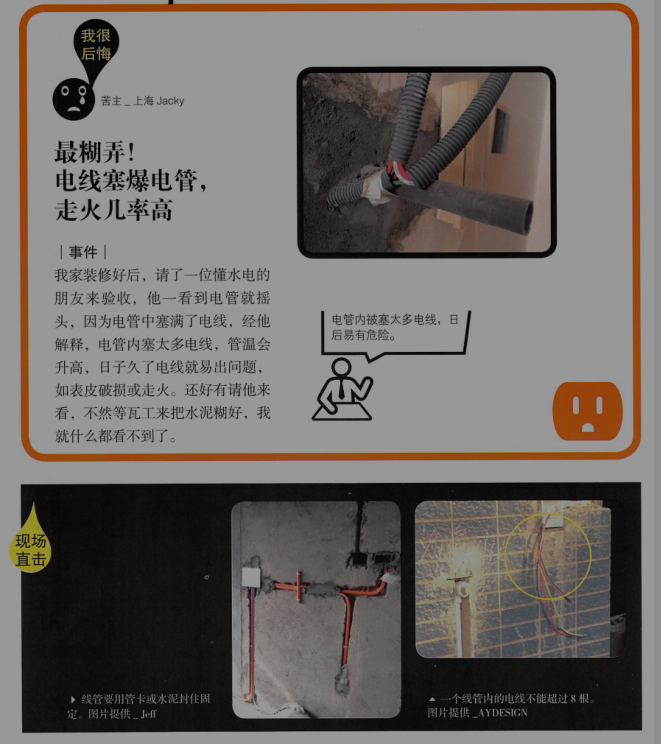

布管原则：强电在上，弱电在下，各走各的，水平距离至少50cm，避免彼此干扰。（电视可能会闪屏）

    1. 同一回路电线要走同一电管内，管内总根数不超过8根
    2. 电源线与通讯线不得穿入同一根管内
    家里的配电箱有两种，一种是供插座与电器使用的强电箱，另一个是管电视、网络的弱电箱。强弱电不能同管。
    3. 强电在上，弱电在下，各走各的，水平距离至少50cm，避免彼此干扰。强弱电要交叠的地方，要用锡纸包裹，降低干扰。
    4. 卫生间电线管，都不能走地板。
    卫生间地板易积水漏水，若电线在此危险性非常高。一般是走天花板或墙面。若插座设于卫生间，也要用防溅型产品。
    

    5.电线与暖气、热水、煤气管之前的平行距离不应小于30cm，交叉距离不应小于10cm
    这个规定对水电师傅来说比较难达成，倒不是做不到，而是忘了。还是那句老话，水电师傅撤场前，一定要到现场验收。
    6. 线管、接线盒都要固定
    线管可用塑胶管卡或水泥，接线盒大多用水泥。篱笆网的案例很多都没有做。
    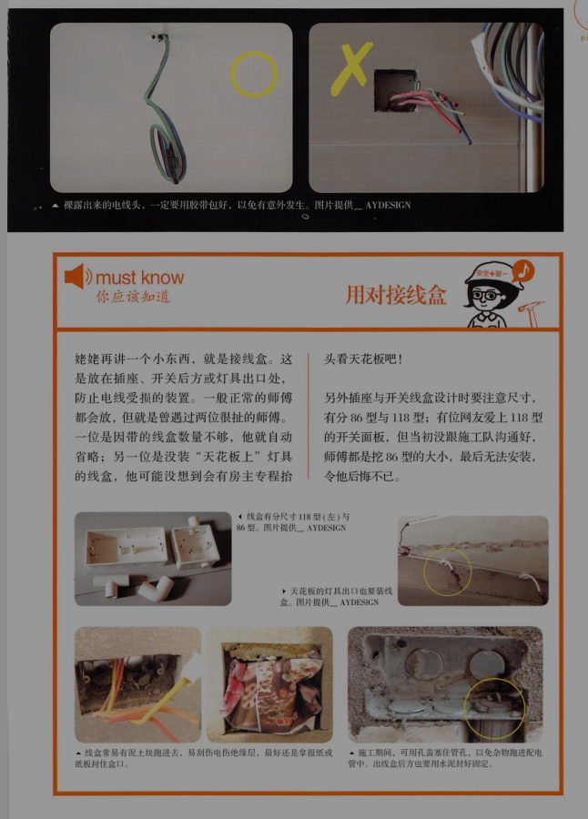


再提醒一点，完工后要跟水电师傅要“管线位置图”，日后若要挖地板或补墙面时，就知道哪里不能打了。    !!!重要!!!

8. 最粗心！热水管紧贴冷水管，容易失温冷凝水

#### 冷热水管，不能靠太近


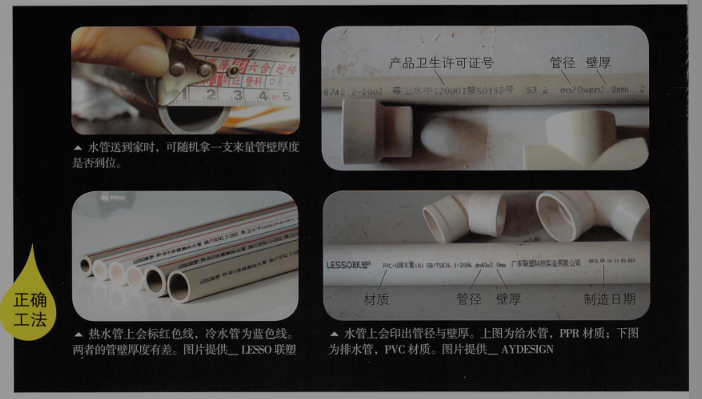

安装水管的几个原则：

原则1：冷热水管距离不能太近，更不能紧贴
原则2：冷热水管要固定环固定好
原则3：长距离拉水管时，要主干粗，分支细
同一根水管管径越长，末端水压会减弱，July家从头到尾都是4分管（外径20mm），当水从阳台一路长途跋涉到卫生间时，早就没力了，易造成末端水压（淋浴）变小。

更好的工法是主干管的管线大，分支管管线小，如一般老公寓从水表下来的进水管为6分管（外径25cm），在热水器、厨房与卫生间的入口处分支管再用4分管。这样较易维持水压。


原则4：水管做好就试水压与漏水
水管装好后，当场要试水压，确实水压够了又没漏就ok了。若有漏水，也很容易找到，千万别水泥都铺上去之后才试水，不然漏水都不知道哪里漏。   !!!重要!!!

有预算的话，冷水管也可改用热水管，管壁较厚更耐用。华北地区可以再加保温层。

原则5：水管埋入地或墙里，覆盖的水泥砂浆要有一定的厚度
墙内冷水管不小于10mm，热水管不小于15mm，嵌入地板的管道则不能小于10mm。

9. 水电，你应该注意的事

[提醒1]弱点箱以方便维修为上
[提醒2]玄关可安装感应灯
[提醒3]进水管安装止水阀
[提醒4]吊架悬挂水管，不必再敲地板


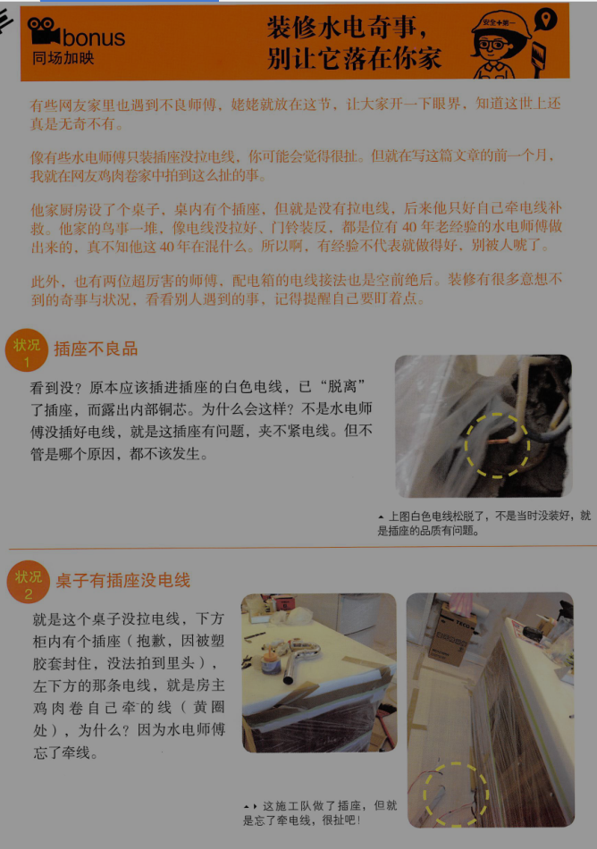


point3：水电工程估价单范例

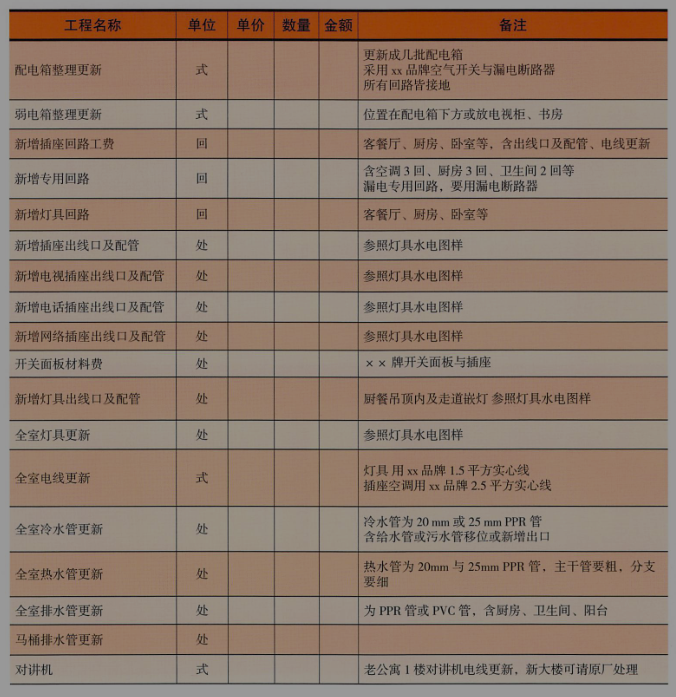
