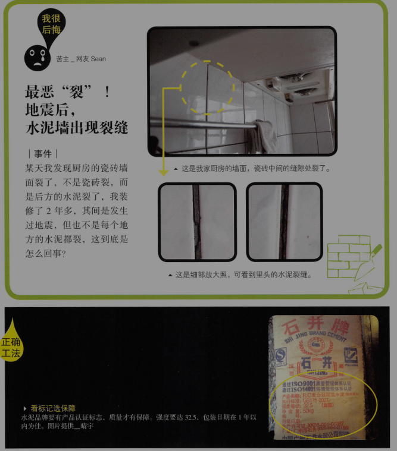
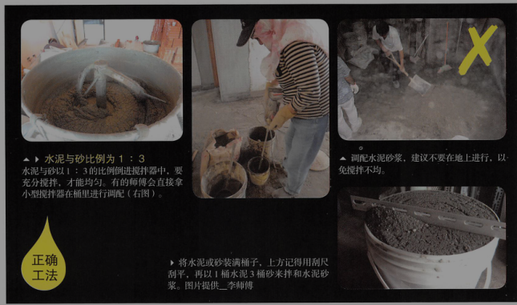
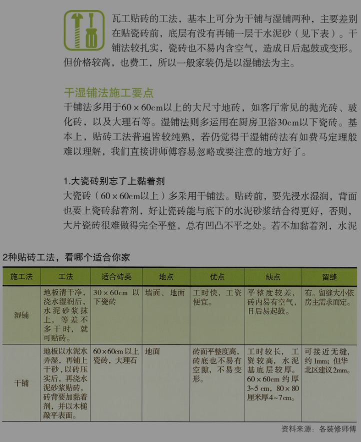
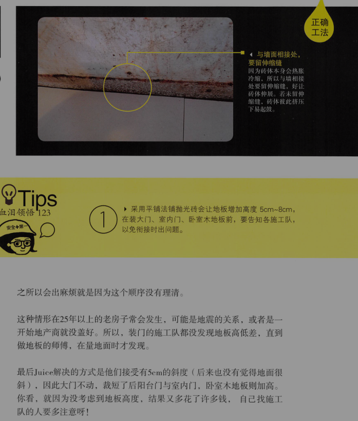
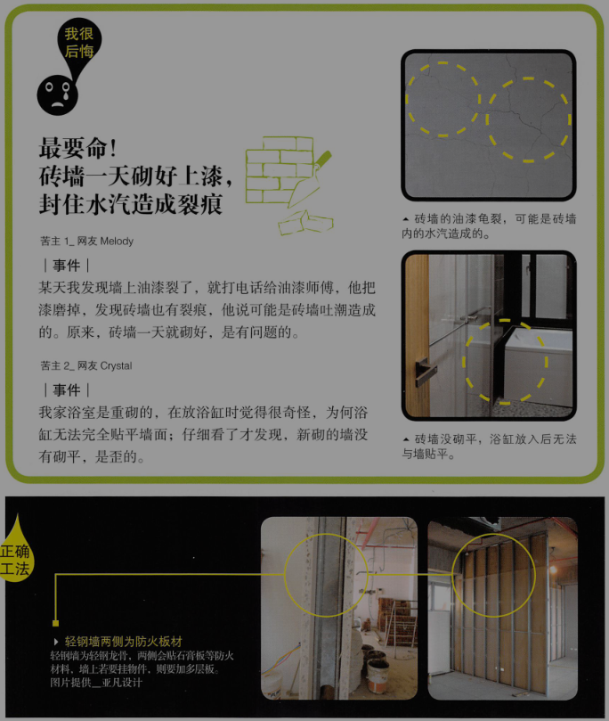
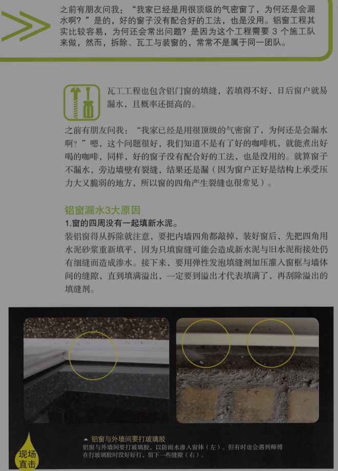
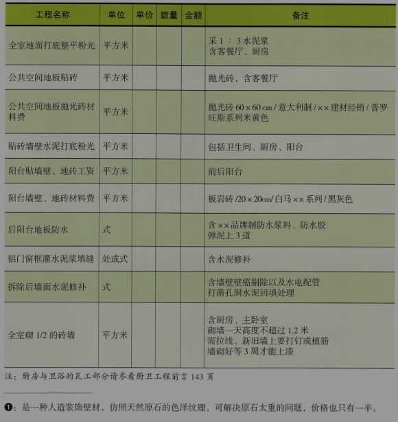
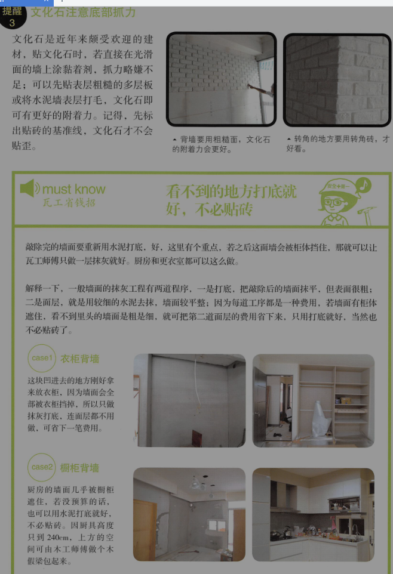

# 瓦工工程

瓦工负责跟水泥相关的一切，包括地面、墙壁的水泥打底粉光、贴砖、砌墙（多是红砖墙）等。做防水也是瓦工负责，所以卫浴、厨房、铝门窗也有部分与瓦工相关。

瓦工有问题的装修，常常是因为“赶工”造成的。为什么呢？因为很多瓦工工程都有花时间等干，才能进行下一道工序。如砖墙砌好要等3周才能上漆、砖贴好后至少要等24小时才能填缝。但现在很多师傅或房主都无法等，就造成后续一堆问题。因此，最好给瓦工较长的工期，才能避免让人后悔的事发生。

point1：瓦工，不可不知的事
[提醒1]回填墙壁地面、孔洞时，要注意是否补平
[提醒2]瓷砖记得要备料，以备日后修复
[提醒3]文化石注意底部抓力

point2：容易发生的4大瓦工纠纷
[提醒1]最恶“裂”！地震后，水泥墙出现裂缝

#### 水泥质量不好，比例不对，易有裂痕

水泥品牌要有产品认证标志，质量才有保障。强度要达32.5，包装日期在1年以内为佳。有的师傅会拿“已结块”的过期水泥或受潮水泥来用，所以最好指定有合格认证的品牌，一年以内生产。

#### 泥浆比例是重点

水泥砂浆是在墙面和地面拆完瓷砖后，拿来铺平基底用的，也叫抹灰工程。打底的水泥砂浆，水泥和砂的比例是1:3，砂子要选中砂为佳。有不少师傅都说错比例，有的还说1:7，可见根本不当回事。

1：3怎么调呢？一铲水泥配三铲砂，水泥太少，会造成水泥强度不够。装修现场的话，师傅们都常有装涂料的空桶子，把空桶子洗干净，将水泥粉倒满桶子，左右晃一下让水泥扎实，上方刮平。如此1桶水泥配三桶砂，简单又接近比例。

打完底后，1:2的比例则适合墙面抹灰了。

师傅大多就在地上直接拌浆，没有搅拌机的话，至少要在大桶内搅拌，保证均匀。

#### 要等干才能进行后道工序

首先要增加水泥砂浆的地面附着力。方法一是铺设前，旧地板要干净，石块，起皮等都要清除；而是地面要浇湿，但不要积水。然后浇上水泥水，就可以铺水泥砂浆了。

铺设时，要等到打底层干了，才能再铺面层。面层做好后即要养护，这养护就要28天。水泥是比较顽固的建材，要等这么多天才能达到设定的强度。而这些天中，要给水泥“铺面膜保湿”，因为它的化学作用得有谁才行，所以得天天浇水。一旦没水，就会出现裂痕。

赶工情况下，有的是否会拿风扇加速干燥，这都会造成水泥强度不够。只是现实终究是现实，28天难等，那至少15天吧。

[提醒2]最不平！铺好地板才发现房子高地落差大

#### 从抛光砖了解不同地砖施工要点

#### 血泪领悟

    1. 采用平铺法铺抛光砖会让地板增加高度5cm到8cm，在装大门、室内门、我是木地板前，要告知施工队，以免衔接出现问题。
    2. 地板拆除后，因地板会不平，要在墙面标上高度基准线，如一米，让各施工队统一丈量。
    3. 自己找施工队的人，要安排好施工队顺序。

[提醒3]最要命！砖墙一天砌好上漆，封住水汽造成裂痕

墙不能一天就砌完，按照规定，每天只能砌1.2米高，但现在为了赶工，大家就睁只眼闭只眼，勉强砌1.5米高，但绝不能一天就把墙从地板砌到天花板，因为砖墙有重量，一次砌太高，下面容易歪掉。

#### 血泪领悟

    1. 轻钢墙上无法挂物件，若有挂物件的需要，记得加片18mm厚的木合板
    2. 考虑到建筑的安全性，做隔间仍以轻钢墙为佳，且价格便宜也较低，厚度也较薄，室内空间会更大。
    3. 砌砖墙时，砖一定要吸饱水，且要等至少两周，最好是三周以后才能上漆，好让砖墙的水汽散出，以免日后有裂痕。
    4. 要以水平定位仪拉线，墙才能砌得直。
    5. 新墙与旧墙衔接处要打钉或植筋

[提醒4]最漏气！铝窗填缝不实，漏风又漏水

#### 只挑好窗还不够，施工还要按步走

point3：瓦工工程估价单范例

#### 瓦工，你应该注意的事

