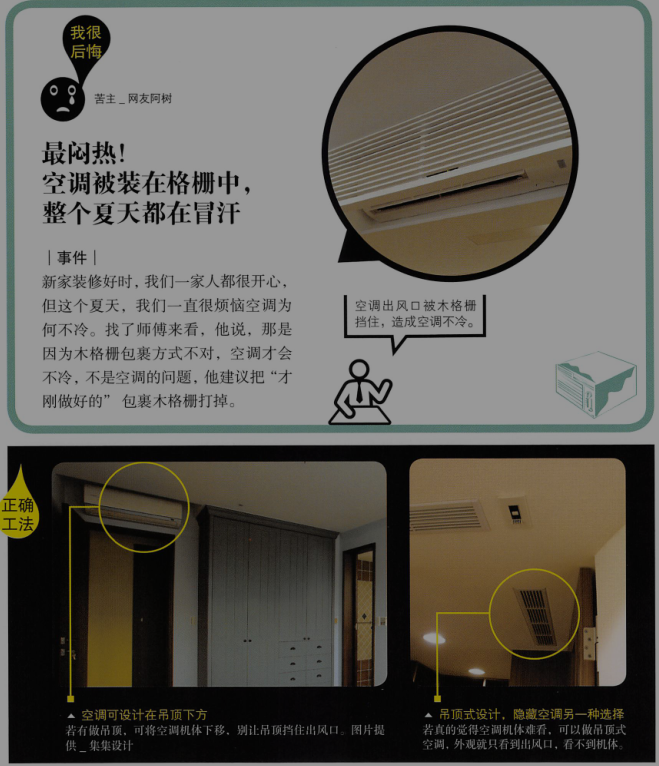
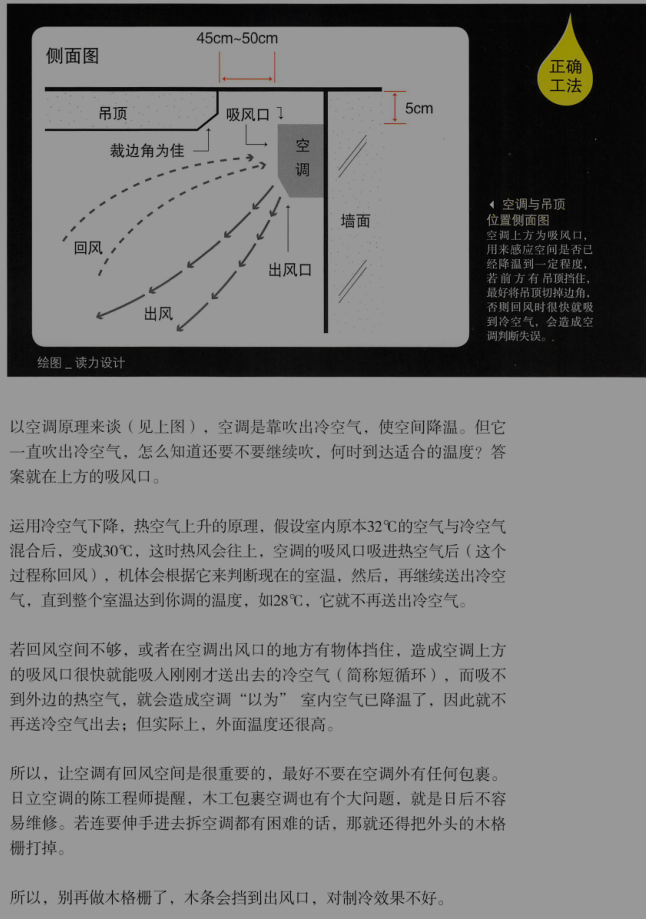
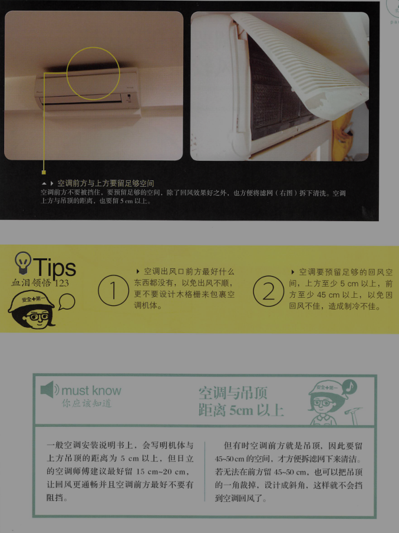
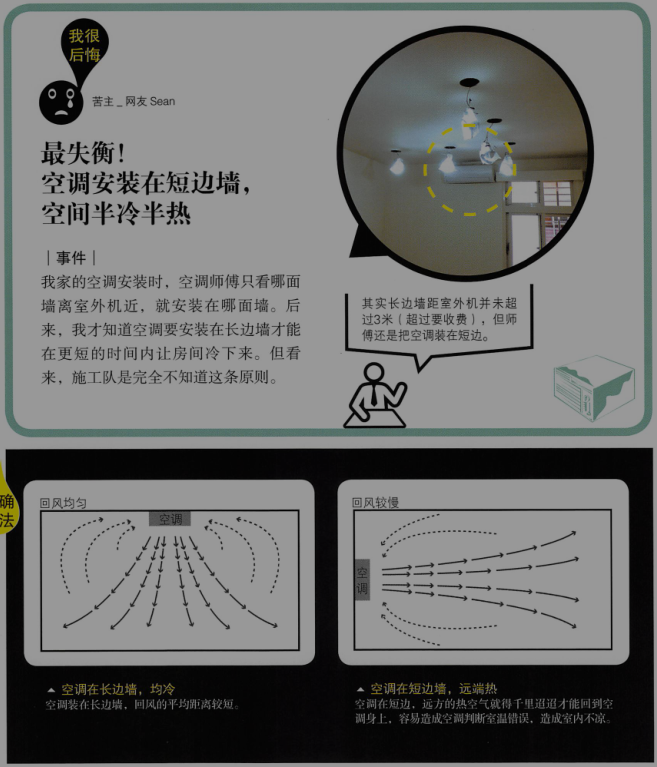
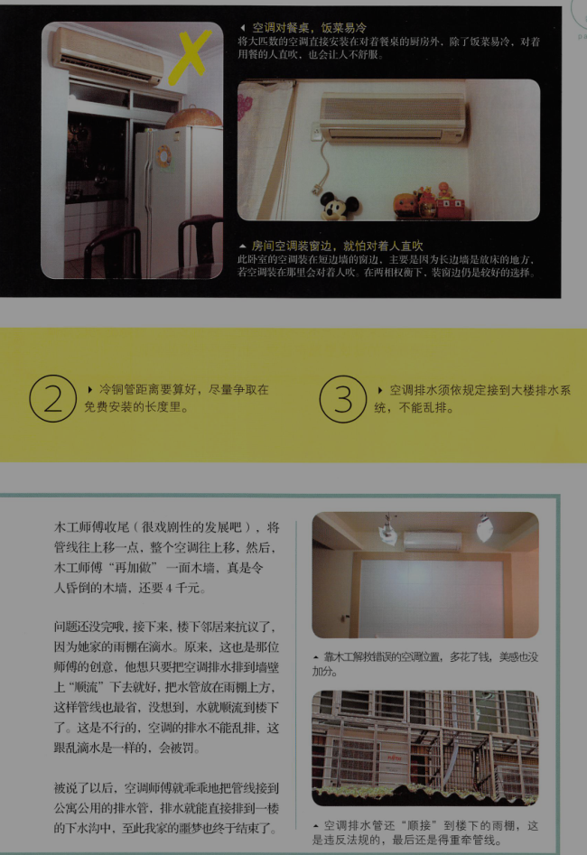
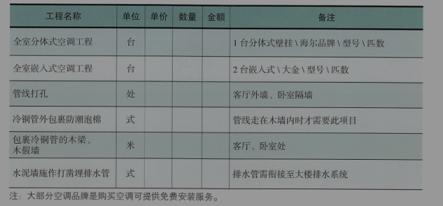
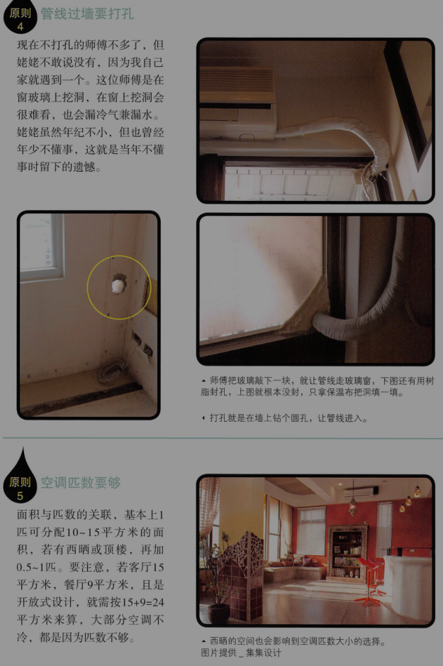
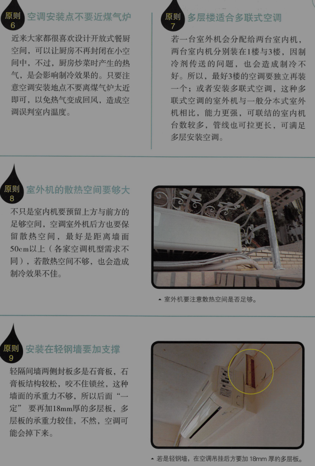

# 空调工程

point1：空调，不可不知的原则
[原则1]室内机与室外机距离越近越好
[原则2]管线要走明管，易维护
[原则2]空调不要对着人吹
[原则2]管线过墙要打孔
[原则2]空调匹数要够
[原则2]空调安装点不要近煤气
[原则2]多层楼适合多联式空调
[原则2]室外机的散热空间要大
[原则2]安装的轻钢墙要加支撑

point2：容易发生的两大空调问题
1. 最闷热！空调被装在格栅中，整个夏天都在冒汗

#### 空调挡住吸风口，空调效果打折扣

2. 最失衡！空调安装在短边墙，空间半冷半热

#### 空调要装在长边墙，回风较佳

point3：空调工程估价单范例

#### 血泪领悟

    1. 在长方形的空间里，空调最好装在长边的墙中间
    2. 冷铜管距离要算好，尽量争取在免费安装的长度里。
    3. 安装排水须依规定接到大楼排水系统，不能乱排。

#### 空调要冷，你要注意的事

空调装修市场报价很乱，3万元起跳，有报4万的

结论就是货比三家，但就算比了，也不代表不会出问题，最终还是会回到施工队对房主对工法的熟悉度。

