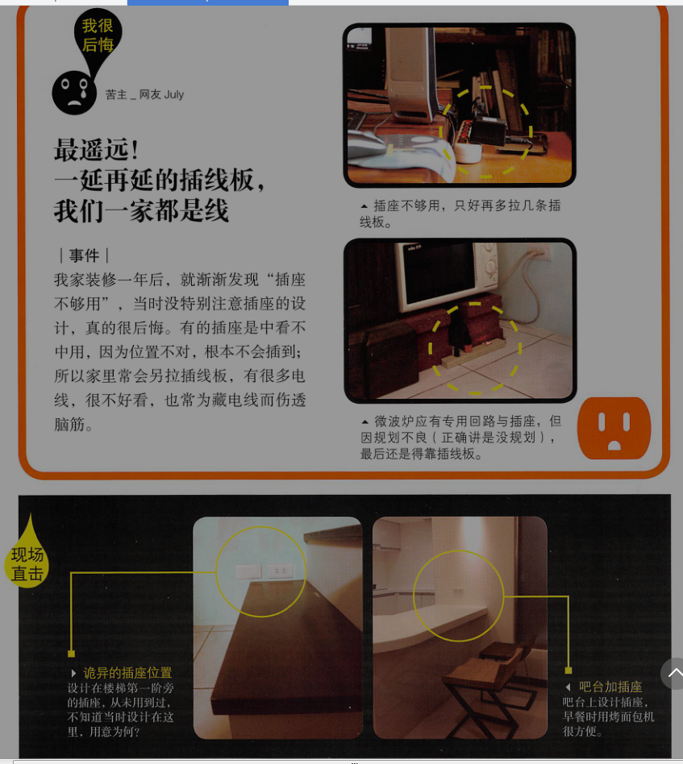
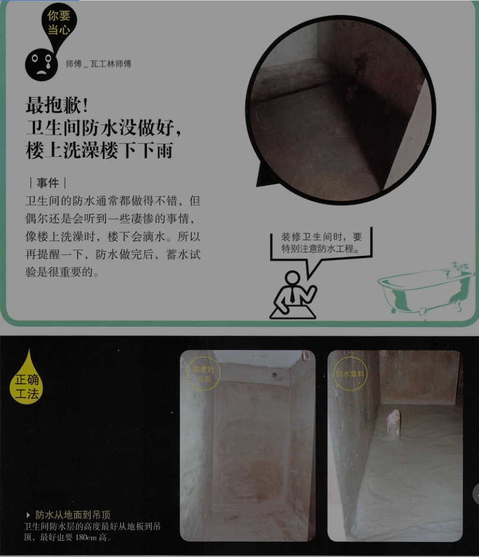

# 装修前

## 挑照片

### 我们喜欢的，不代表别人懂

要把喜欢的居家照片给设计师看，对方才会明白你要的是什么。

如果要找施工队，照片也很重要，以免口头说出来不准，做出来跟你想象的差距太大。没有照片，也可以画图样，若日后纠纷，可据此为证。

不要任意请施工队帮你设计空间，不然九成以上的施工队美学眼光不足，只会大杂烩。

### 挑照片四大原则

要记得，照片挑了以后要尽量百分比复制，包括地板到墙壁的颜色，同样风格的家具配置等，因为别人配好的就是比较美，你才会喜欢。有事多一面红墙就会破坏掉原风格。

#### 为了可实现，歌剧要挑与家里差不多的

家里风格不必各厅室要完全一样，客厅、餐厅、卧室、儿童房或卫生间可以各有各的长相，但是前提是这几个空间完全独立。这样就不会显得混乱。

#### 为了省钱，挑木工少的

定制衣柜，橱柜，储物柜，可以选地板颜色与你家相近的。

#### 为了好看，挑地板颜色跟你家一样的

家好不好看，大面积的墙色、地面会有决定性影响，那么在挑照片时，要选地板颜色与你家相近的，再根据照片来改造你家。

#### 为了预算，挑装修与家具费用在你能力范围内的

没有钱买名品家具，就尽量不要找家里放满知名设计品牌家具的空间照片，当你换成国产廉价家具后，整个感觉就会走样。


## 收纳篇

### 记录家当

记录一下你的家当有多少。记录家当可以用厅室的格局来细想物件的数量，如玄关、客厅、餐厅、卧室、厨房、卫生间、储物室等。如果衣服一件件算有点麻烦，可以用现在的衣柜大小当标准，如几个2米宽，2.4m高的衣柜。

记录时，不只是单纯记录有什么东西，而是要把这些东西的三围尺寸都记下来。以免发生电器柜做好后，微波炉放不进去的事。

### 记下自己和家的互动关系

进门是习惯放下口袋的钥匙或零钱，还是包包、还是挂上自己的外套。遵照自己的习惯。

### 不是做木柜才叫吸纳设计

一整面的书柜，但是一直是空的，没有书，也没有记录品，展示品。却把书堆在茶几，沙发。这是就可以省下书柜钱，买几个收纳篮，房主茶几和沙发旁边。

最后的建议，找个空间当储物室，不用打，3平米左右，可以放电扇、行李箱，杂七杂八的东西。设计师总能找到，而且设计得好好的给你。

## 学会做决定和负责

1. 签约后，条约上没有保障你的部分，就算你不知道自己的权益也没办法，只要签了名，都算是你答应的。

2. 凡是因“美感”观点不同而产生的纠纷，法律都不会理你，包括品味，色彩美丑，木皮纹理好不好看等。

### **别把决定权交给设计师** 

设计师或者施工队，他们是专家，但是都不住你家。他们会对工法和建材提意见，但是下决定的应该是我们自己，且应该要对此负责。

案例：

1. “都是设计师当时强迫说要做和室，我后来想想真的没什么用，我要改革局，竟要向我收费。”“那你当时有答应要做吗？”“是有啦，但我没知识没法判断，都听他在讲。”

2. “原本觉得水泥做的家具很酷，设计师就做了水泥茶几，没想到，太重了，根本搬不动，我想退货退钱。”

3. “原本看的窗帘样式还不错，波普风很可爱，但是没想到一整片落地窗帘装上去后，变得好乱，很不好看，我要求更换窗帘，施工队竟然说要收费，他建议错的，为何我要付费？”

4. **“我想说为了表示信任设计师，也希望给他好感，就先给了1万元订金，之后才签涉及约，但后来设计师只给了我一张最普通的平面图，就是来我家，丈量一次后所画出来的图，喜多尺寸还画不准。后来。因为我与设计师意见不和，不给他做了，请他退订金，他竟然不退。”** 

**签了涉及约后，到底要给几张图，给什么图，这很重要，也一定要在合同中列明，例如：平面图、天花板图、水电图、立面图、厨具图等，但若你签的合约里头什么也没写，而这个合约你也签名了，及时对方只给一张图，你也只好自己认了。** !!!重要!!!

```
    1.原始平面图(以现场测量为准) 
    2.墙体改建图(小公司大多不画这张)
    3.平面布置图(含量最高的一张,往往外行客户只看这一张)
    4.顶面布置图(吊顶造型,层高,灯具,空调,浴霸等详细尺寸图)
    5.地面铺装图(地面材料及铺设规范)
    6.强电布置图(冰箱,空调等强电流线路走向布置)
    7.弱电布置图(灯具,电话,网络灯线路走向布置)
    8.开关插座图(开关及插座的详细布置图)
    9立面图 (若干张, 其中必画的有,厨房立面,卫生间立面,餐厅背景立面,电视背景立面)
    10.节点图(是指一些详细的施工图,复杂的造型及规范的施工都需要此图)
```

### 学会听建议，下决定，然后负责

好的施工队和设计师会跟我们讲，用某种工法的好处和缺点。

例如不锈钢合叶的好处是不易生锈，但缺点是贵；用一般合叶的好处是便宜，但在潮湿处易生锈；又例如他们会建议用篮网当抽屉，较透气也便宜，但可能看起来比较廉价。

然而功力不足的设计师就无法提供你正反面的意见，只要你说的都说好。

对于设计师而言，对于争议性大的工法解释清楚后，可请房主签协议书，对设计师自己也有保障。


## 装修流程大解析

自己找施工队的人，要安排好施工队顺序。

例如出具要在水电前定位，若没定位好，插座可能无法跟电器柜相合，不要以为厨具是最后才送到，到时决定就好，因为与水电工程相关，就得提前确定；

又如想空调管线没拉好，木工师傅来了也无法封吊顶。若师傅采用工时制，来一天就要给一天钱，即使没事做，钱还是照付。

### 装修流程 !!!重要!!!

+ start：前期作业

包括确定格局平面图，灯具如何配置等，家具与建材也可以开始逛了，若能确定家具最好，家具定位后，插座的位置，吊顶的高度等都能配合家具设计，这样才不会在装修做好后，被迫放弃很喜欢却尺寸不合的家具。

+ step 1：拆除

要拆那几道墙，地板要不要敲除，排粪管要不要换等，确定好后再拆，以免拆了还要做回来。

+ step 2：水电

冷热水管与电线要怎么走，灯具，厨具，空调的位置要先定位；

若重新砌墙要走电线，瓦工也得先进场，因为砌墙后还得等晾干。

实地测试：可预先标出所有设备的位置，包括插座、开关、厨具、家具等，最好都标出来，只要用粉笔画出大概位置即可，看看顺不顺眼，会不会挡到动线或太拥挤。因为许多人看平面图是没有感觉的，先画出来实地测试，以免到时又要修改。

+ step 3：瓦工（铝门窗，铁工）

卫生间防水、贴砖都在此阶段，因此施工队进场前，要确认好瓷砖的料会于同一天送到家里，不然师傅只好在家聊天嗑瓜子了。瓦工也包括填补门套窗框，所以铝门窗施工队要同期进场；同步的还有铁工工程，如楼梯扶手、雕花装饰等。

+ step 4：木工

主要是做柜子，所以柜子造型与收纳功能要确定好。天花板有涉及线板者，要在木工进场前选好线条板样式。

+ step 5：油漆

记得做好保护工程，以免被喷得到处乱七八糟。

+ step 6：粗略清洁

会动用到清洁车，要先打听好车子可以停在哪里，也要确认到场时间。

+ step 7：设备进场

清洁完后，卫浴设备，厨具，系统家具，灯具，壁纸等就可以进场了，木地板也是在这个阶段进行。

+ step 8：仔细清洁

可以找保洁公司，或者全家人自己做清洁

+ step 9：家具窗帘进场

随你高兴，选个黄道吉日，搬家咯！

+ ending：

恭喜恭喜，晚上可以在新家睡觉了！


总结：

只要你多问，师傅们大都会跟你讲，他们也不希望白跑一趟。

油漆工程主要是在木工后进场，但家具和卫浴清洁用具搬进家时，难免会撞到墙面，可以清油漆师傅再回来补漆。这点要事先和师傅讲好。但若是用喷漆，补漆会造成补痕，这就需要保护好墙面。

装修流程可分为两大部分，一是前期作业，一是施工工程。前期作业想的越详细越好，日后重做或追加的施工项目会减少很多，也就越省钱。但我知道许多人急着搬进新房子，那至少想好八成后再动工。

# 不后悔装修书

## 拆除工程

在拆除之前，一定要先想好家里的格局，不能操之过急，不然容易白做工。

另外，拆前也要多想想有没有什么东西可以再利用的，如柜子内部都还好好的，只有柜门旧了不符合风格，就可以不拆柜身，既省钱，又不会制造无谓的垃圾。

point1：拆除，不可不知的事

[提醒1]请先断水断电断煤气
[提醒2]检查漏水
[提醒3]检查有没有蛀虫
[提醒4]窗框拆除，内角水泥层一起敲
[提醒5]窗外的瓷砖是否敲除，得先告知施工队
[提醒6]拆窗后，要用帆布封窗
[提醒7]消防管线、洒水喷头不能移位或拆除

point2：容易发生的4大拆除纠纷

1. 最抓狂！排粪管不知何时被打破，得敲掉水泥救漏水？


讲好“全室换管”
，别以为就是“全部换”！热水管，冷水管，排粪管。师傅会跟你说，“一般”都是不换排粪管的，所以想换排粪管，要特别跟水电师傅说，若不换，则要叮嘱，拆除时小心别敲破排粪管。

拆除师傅敲破后也不讲，然后水电工与瓦工也不看，就 封起来了，后来做蓄水检测时，楼下反映漏水，这时候就晚了。后来与师傅协商，没人承认错误；拆除师傅说不是他们打破的，水电师傅也说不是他们打破的，最后从照片分析，水电师傅在装洗手台的水管时，就“应该”看到了，却没有发现，所以决定由水电师傅来补。

水电师傅不想再动大工程，就用软管塞进粪管中来补救。但这种软管易破，日后若想通马桶，不能用高压棒，不然，软管破了，再漏水的机率很高。


因此拆除做完后，要带着水电师傅，当着拆除师傅的面到卫生间来检查，若水电师傅当场都说OK，日后有问题，水电师傅就要抗责任了。 !!!重要!!!

#### 血泪领悟

    1. 排粪管换不换，要先想清楚，然后拆除，水电和瓦工师傅三方都要知道。
    2. 有状况要与施工队沟通，一定要找到施工队长。
    3. 每个施工队交接时，要带接手的施工队一起检查，如拆除师傅撤场时，可带水电与瓦工师傅一起检查，这样打破水管或者没有敲好地板，责任就都有人扛了。
    4. 看工地时，就当在看观光景点，能拍照就拍照，每个房间和细节都拍，日后要检讨工法时，说不定能派上用场。


2. 最揪心！白拆了的瓷砖地，白付了一笔钱


拆除后会有大量垃圾要清运，在拆除前，可先问问大楼管委会或者附近邻居，大型垃圾可以放在哪个地点，以及清运车可以停在哪里，以免到时被赶来赶去，甚至被罚。

要考量电梯的高度，拆下的门是否进得去；砂石要打包好，不然边运边漏砂，会引来邻居抗议。

记得最后一台清运车离开前，再看一遍家里是否该拆的都拆完了，有些小地方易遗漏，如对讲机，门框，踢脚线等。

#### 血泪领悟

    1. 铺多层复合或者强化复合木地板，原本瓷砖地板只要够平整，可不比拆除；弹药视现场情况而定，若有瓷砖起鼓变形，仍要拆除。
    2. 地板要不要拆除见底，要看铺什么类型的地砖，以及要考量新大门的门槛高度。
    3. 跟施工队沟通，要知道的是不同做法会有什么不同的结果，而不是你说什么他就做什么。

3. 最心烦！听信施工队与设计师，阳台外扩惹麻烦


剪力墙，RC墙（钢筋水泥墙）等结构墙都是不能拆除的，一般厚达15cm以上，内有钢筋。

可以拆的墙多为砖墙或轻钢墙。砖墙敲除表层后，会看到红砖，厚度约12cm；轻钢墙则会看到前后的石膏板等钢材，厚度约10cm。


#### 血泪领悟

    1. 只要是阳台外扩，包括拆掉落地窗旁的两侧墙面一般都是不允许的，不过可以尝试跟物业确认。
    2. 若设计师或者施工队说可以外扩，请他们签责任书，以免日后反咬你一口。


4. 最傻眼！地砖污染，防护工作只做做样子


地板，要保留的大门，室内门，柜子都要包好，以免在施工和搬运建材时不小心收到撞击而损坏。卫生间则除了要注意地板和浴缸的覆盖外，还要用胶带封住水管，以免细碎的砂土不知不觉间渗进去，造成日后处理的麻烦。


point3：拆除工程估价单范例


5. 拆除，你应该注意的事

拆除前、中、后，都有些该注意的事，例如要先断水断电以保安全，再来，可趁干扰视线的杂物或木墙等障碍清除后，好好检视一些平常不见天日的角落有没有壁癌或漏水。至于哪些该拆哪些不能拆，最好在现场交代清除，建议再用纸写下来，因为不是每个工长都记性良好。

拆除的工期长短不一，以100平米的老房子全屋拆除为例，有的工长一次派5\~8人，一上午就拆完了；如果是2\~4人，慢慢悠悠，就得拆个2\~3天。所以要问清楚，以免你到现场时，该拆的不该拆的都拆完了。

+ 提醒1：先断水断电断煤气
断水是关水表总开关，断电是关总开关箱，断煤气则是把总开关关起来。若要改煤气管线，要与煤气公司联系。

+ 检查漏水

漏水分为两种

一种是明目张胆出现在你眼前，常在墙角，以壁癌的样子呈现；另外在卫生间周围的墙壁以及会直接淋到雨的外墙，都较易漏水。

第二种是隐蔽式的，藏在地板或者木墙内。例如，当地板敲掉瓷砖时，水泥地是湿湿的，就可能是水管破裂，但也可能是由外墙渗透进来的；还有当木墙或吊顶拆掉后，才发现原来里头的墙早已面目全非，爬满壁癌。

遇到漏水要立刻处理，且须在瓦工师傅施工前把漏水源头找出来，不然，水泥封底后，还得再挖开来，费钱费心。找漏一定要找到漏水源头，比如壁癌，如果是因为水管渗水造成的，就得先把水管修好，不能只把墙壁表层清除掉后直接涂上防水漆。如果源头没有解决，日后还是会产生壁癌。

+ 检查有没有蛀虫

踢脚线内或者木柜内有粉末或者细木屑的话，就是可能遭蛀虫了。

+ 窗框拆除，内角水泥层一起敲


+ 窗外的瓷砖是否敲除，得先告知施工队


+ 拆窗后，要用帆布封窗

+ 消防管线、洒水喷头不能移位或拆除


## 水电工程

拆除完成后，接下来就是水电进场。

包括换冷热水管，重新配电线回路，整理配电箱等，也是各工程中最常被偷工减料的一环。因为电线、配电管、灯泡等，都藏在天花板中，做完验收时看不到，设计师也不见得懂，所以会出现某些不良施工队在里头鱼目混珠的情况。

要避免这样的问题，首先，材料进场时的监工是绝对必要的；此外，要特别提醒大家，水电的预算千万不要省，因为豪宅级的做法也不过多个几百元，支付合理的费用，可让整个家住的更安心。

point1：水电，不可不知的事
[提醒1]弱点箱以方便维修为上
[提醒2]玄关可安装感应灯
[提醒3]进水管安装止水阀
[提醒4]吊架悬挂水管，不必再敲地板

point2：容易发生的9大水电问题

1. 最气结！漏电断路器被掉包

### 不想被糊弄，得先认识配电箱


配电设计是整个家里最最重要的工程，但多数人却不太在乎。房子美轮美奂，但是电线全是黑心货，用电回路也不足，整间房子就像绣花枕头。真的建议大家多花点预算给水电工程，只有多个500元（需考虑通胀，现在可能不是这个价格），你会换回更多的“安心”，是值得的。

#### 带你摆脱危险——空气开关

别名很多，微型断路器、微型断路器，小型断路器都是它，英文简称MCB（Miniature Circuit Breaker）。主要功能是电线短路或用电量超载时，它会“跳闸”，可以保护我们免于电线走火。空气开关要选有安全认证的“CCC”产品，一定要指定品牌，以免用了次级品。因为一个16A的空气开关价格可差5至10元，有些人砍水电的费用砍得多了，师傅们就从这些材料省点钱。

#### 近水处保护你——装漏电断路器

漏电断路器有不同的规格，现多用二合一型（RCBO，漏电加短路过载保护合一），当测到漏电时，就会跳掉。配电箱中，最常见的问题就是：分路回路没有装漏电断路器。

关于家装电气设计，《民用建筑电气设计规范JGJ16-2008》第7.7.10条规定，“家用电器回路与插座回路”，要装漏电断路器，而家装回路不是给电器用就是给插座用，所以结论就变成每个回路都要装漏电断路器。

国家都有规定，但是上有政策下有对策，我手上的配电箱方案中，没有一个照规定做的。为什么不装？就是水电师傅想省点钱。一个漏电断路器16A1P的要60\~120元，但同规格的空气开关约12\~24元。因此该装漏电断路器的地方就用空气开关代替了。


两兄弟长得也像，小心被调包。漏电断路器比空气开关大只，外壳上会注明英文RCBO或者中文漏电断路器（另一种漏电附件叫vigi），还会有一颗测试钮，建议每个月按一下，可测试漏电跳闸的功能是否完好。

但若真的预算有限，无法每个回路都装漏电断路器，姥姥建议至少有水的地方，如厨房、卫生间、工作阳台等处要装，电热水器、高功率洗烘衣机等用电器也要装，现在电器质量不一，假货也多，若真漏电了，你会感谢自己装了漏电断路器。


#### 血泪领悟

    1. 什么钱都可以省，什么装修都可以不做，但电的部分不要省，多个500元，你家更安全。
    2. 各回路都要安装漏电断路器，至少有水的地方，如卫生间，厨房等都要有

#### 漏电断路器不要装在总开关

一般漏电断路器要装在分路的回路上，也就是卫生间与厨房、阳台的回路，而不是装在总开关处。原因是跳闸时，若装在分回路，就可以从单一回路去找漏电的地方，若是装在总开关，就得在8个或者更多回路上一一去找哪里漏电。


2. 最无力！换了新电箱，但一样会跳闸

### 怎么又跳闸了？回路设计的8大基本概念


每间房子对于配电的需求各不相同，100平米的房子，配电箱多设为8P到10P（P为空气开关的单位），但大家发现了，许多东西是没算进去的，如浴霸等，若考虑未来可能要增加音响设备等电器的回路，大概会用到15\~20P。

+ 要先详列电器
列出所有的电器，才能回推你家需要多少回路，不用空想，尤其是厨房，高耗电的微波炉、烤箱、电磁炉、电热水器等，都有列出来。

+ 空调
通常是看室外机有几台，就用几个专用回路，如一台分体式1托2的空调，因室外机是一台，所以就配一个专用回路。

+灯具
全室灯具可用1个回路包办，最好单独一个回路，有的会与插座同回路，这样不好，若插座跳闸，等就不会亮，影响较大。灯具回路通常用1.5平方电线，法定可承受电流是14.5A，若家中的灯具太多，电线可配2.5平方，此部分可请水电师傅评估。

+ 卫生间插座
插座就比较复杂了，要分几个区域讨论。首先就是卫生间，因湿气重，所以插座、灯具与暖风型3和1浴霸可共享1个“漏电”回路。所谓漏电回路，是指此回路要装漏电断路器（请一定要装）。若有电热水器，用电量超过12A，则要再多加1个漏电专用回路，不然若同在16A的回路中就易跳闸。


+ 厨房插座
小型电器都可合用1个回路，要注意的是，厨房有水，所以回路要装漏电断路器保护。

但若有大功率、高耗能的烤箱电器，则要另配1个专用回路给它用，不然容易跳闸；像越来越多人会用380V的电器，如蒸烤炉或国外大功率厨房电器（超过2500W），这些电器都不能使用220V的插座，再要另外安装400V插座或专用回路，才安全。

冰箱也可以考虑专用回路，若与其他厨房电器公用回路，只要跳闸，冰箱就停电了，冷藏食品会坏掉。

+ 阳台插座
阳台有洗衣机，也要1个漏电回路，若有安装洗烘机等大型耗电器具，也要再增设专用回路。

+ 客厅和三个房间的插座
基本上可用一个回路，主要是看用插座的家电用电量，一般小家电都不大，也不会同时使用，所以1个回路即可。但若插座数量太多，超过单一回路的承载电量，就得再多加一个回路。

+影音柜
你可能没钱弄一套百万音响，但若想让自家的千元音响也有好声音，只要给电视柜或影音设备一个专用回路，音质画质就会大大提升，这是花小钱提升质量的好方法。

#### 三室两厅回路运算实例 !!!重要!!!

易100平方米三室两厅的格局为例，实地算一下。但在进入实地演练之前，姥姥得先说明，因为各家电状况不同，范例只是示范，你还是要根据自身情况，找配电人员详细讨论。

解释一下总计的数字算法。家用配电箱最常用的就是单排导轨，大小尺寸单位为“位”，空气开关1P为1位。

照范例来看，“基本款”总开关箱的大小为，10P+总开关1x2P=12P(具体计算参看下表)，即要用12位以上大小的配电箱。

每间房子有不同的需求，现在一般配电箱多设定在8\~12位，但大家也发现了，许多东西都没算进去的（如大烤箱），若全部算入，或考虑为了所需的足够数量（如要增加音响设备的回路），大概会需要用到16位以上。

水电达人建议，8位与16位的两种配电箱价格，不过就差个几十块钱，在整个装修工程费中就是九牛一毛。整理电箱贵在人工费，所以不如一次就装大一点的电箱，日后就不必再花好几百来敲换或增设电箱了。


+ 地暖
地暖有分水暖或电暖，此处是指发热电缆的地暖，配几个回路要视使用功率大小而定。一般16A回路可承受功率3200W的电地暖，但可为了安全使用功率会减20%，所以是2816W，约是36平方米所需用量。若面积大于36平方米，最好再增设一回路。

好了，再看看July家500元换了新电箱，也增加了回路，但为什么电热水器加浴霸一起用，或再加上吹风机，超过电流量16A，就会跳闸了。


回路与专用回路的不同


3. 最不便！使用家电，还得错开时间搞宵禁

### 怎么又跳闸了（二）？单一回路的电量算法


#### 回路=电路上所有插座的用电量

电路中所有插座上“同时使用”的电器用电量总和，而总和不能超过电线能负荷的电流量。

一个回路电线在配电箱中会连接一个空气开关，打开你家的配电箱，看看泥头的空气开关是几安培的。

#### 安培=电流量单位

安培 A = 功率 W / 电压 V


拿16A的回路来看，电饭锅3A + 微波炉4A + 烤箱4A + 冰箱，果汁机，灯具等4A = 15A都安排在同一回路，若再加一台豆浆机3A，这个回路就承载看18A，全=都同时开启就会跳闸。


#### 高耗电电器不要放在统一回路

在现实世界是一般厨房只设1个回路，对也没有装漏电断路器（唉，千万别省这点小钱）。所以，知道哪些电器会同时使用，这对规划回路很重要。原则就是高耗电的电器不要放在同一回路，要高低配，所以像大型微波炉及烤箱（小的就无妨），电磁炉最好分配在不同的回路中。

当然不会算的话，找一个专业的水电师傅帮你算。

#### 空气开关不是装越大越好

一般常见回路的空气开关是16A或20A，但常有房主怕跳闸，会要求空气开关装高安培25A或32A。其实这是错误的，空气开关跳闸时好的，是保护我们。

再来，空气开关若没有跟电线同步升级的话，装越大的安培数，反而越危险。

电器总电量 <= 空气开关（或漏电断路器） <= 电线

家用电线多是单一铜芯实心线。依据实心线的截面积大小又分为1.5、2.5、4、6平方等，不同大小的电线可承载的最大电量（简称载电流）也不同。但实际你搜到的厂家，1.5平方线，15A到19A都有人写，那到底是多少呢？

1.5平方线只能承载最大电流14.5A。

如果空气开关过大，就有可能电线都烧了，空气开关还没跳闸。

那家里的灯具、插座、空调回路等要用多少平方线配几A空开呢？

!!!重要!!!

若厨房插座回路，将电饭锅、微波炉、烤箱、冰箱、电热水壶等最大用电量加起来若是20A（插播一下，最常见的5孔插座载流量是10A，记得同插座电量不能超过10A哦），这时的两种做法：

```
方案A：用4平方线单一回路，因可承载26A，再配20或25A的漏电断路器
方案B：分成2个回路，用2.5平方线，每个可承载19.5A，漏电断路器搭16A。这个方案会比较好，对插座的保护比较高。
```

但要注意每一插座回路上的插座数量不宜超过10个；若是照明回路，电流不宜超过16A，光源数量不宜超过25个。

再来举例专用回路，如空调、地暖、电热水器或大功率电器。

像1.5匹以下的冷暖空调，最大用电量在制热，不到10A，就可接1.5平方线，搭10A的空气开关；若是3匹的柜机，制热会达25A，就需要装4平方线（26A），搭25A空开。但因为空调开的时间比较长，大人也建议电线可用粗一点的6平方（34A），空开用32A。 !!!重要!!!

不过，在现实世界中不少水电师傅都不会按照规范来配，有时就是会安装“高一点点”的安培数，像2.5平方线最常配20A。为什么呢？一是认为2.5平方线载流量大于19.5A，有厂家还写的是26A，虽然与国家规范不同，但我们可以选择相信或者不相信，相信的人，就可以用20A的用电器和相应的空开。

另一个因素是：只要跳闸，不但会被房主骂，也要再跑一趟维修。

#### 墙内电线最大承重电流量   !!!重要!!!

--- | --- | --- | ---
电线截面积 | 载流量 | 空气开关 | 常用回路
1.5平方 | 14.5A | 10A | 灯具
2.5平方 | 19.5A | 16A | 灯具，插座，厨房，卫生间，2匹以下空调，电热水器专用
4平方 | 26A | 25A | 专用回路为佳，如大功率电器，地暖，大二匹空调
6平方 | 34A | 32A | 专用回路为佳，如大功率电器，地暖，3匹以上空调


#### 血泪领悟

    1. 单一回路的用电量，就是电线上所有同时使用的电器电量总和。高耗电电器，如蒸烤炉，电热水壶、电磁炉等最好不要在同一回路。
    2. 插座单一回路插座数量不宜超过10个；是照明回路，电流不宜超过16A。
    3. 空气开关不是安培数越高越好。回路若用1.5平方线，空气开关以10A为佳；用2.5平方电线，空气开关以16A为佳，20A安全性会差一点点。

4. 最担心！小小电线大学问，配电不佳电线烧毁

#### 电线用了黑心货，超怕随时短路起火


#### 制造年代要在3年内    !!!重要!!!

所以“有交代”要用合格的电线是很重要的。合格的电线上会印上检验认证“CCC”的字样，电线送到家时要看一下制造日期，最好使用3年以内的电线。电线绝缘皮的耐用年限约15\~20年，但就是有些人会买到库存电线，或者二手电线。

从颜色上看，电线有很多种颜色，是为了区分相线（火线），零线（中性线）与地线。但姥姥在找电线资料时，发现一个怪现象，各个厂家和设计公司说的都不一样。有的说，火线要用红线，有的说什么颜色都可以；零线也是一样，大家对用什么颜色看法不一。

还好我没由国家标准。

配电时，相线与零线的颜色应不同；同一住宅相线（L）颜色应统一，零线（N）宜用蓝色，保护线（PE）必须用黄绿双色线。

翻译一下就是：相线就是火线，没规定颜色，但全室要统一一个色（大部分是红色），不能红的黄的混用；零线最好用蓝色，因为是用了“宜”这个字，也没强迫性，但我建议就用蓝色；保护线就是地线，“必须”用黄绿双色线。

电线工法中另一个要注意的就是地线，因为最常被“省略”掉。在配电箱中，会有两排铜线，一个接零线一个接地线。接地线可让用电更安全，但有的师傅会偷懒，不接地线。结果就可能会触电，这要小心。    !!!重要!!!

#### 血泪领悟

    1. 电线上会印上检验认证“CCC”的字样，电线送到家时要看一下制造日期，最好使用3年以内的电线。
    2. 地线一定要接，保护线（PE）必须用黄绿双色线。
    3. 全室电线最好是火线红色，零线蓝色。
    3. 插座背后底盒，火线与L极相接，零线接N极，地线接中奖的接地极。


5. 最遥远！一延再延的插线板，我们一家都是线

#### 插座涉及乱糟糟，有时不够用，有时没有用



装修前，一定要找一个专业的水电师傅花个七天七夜一起商讨。这个电的部分，水电师傅比设计师重要，因为许多设计师不懂电，最好三位一起谈。

有的设计师会画出插座灯具图，那没有设计师的或是施工队没办法画出图的也不用担心，只要用粉笔，可以与水电师傅一起吧插座预先画在墙上，看看位置好不好用。

插线板接入并不会增加回路上的最大安培数，所以很多大功率用电器同时使用要注意用电上限。

怎么解决这个问题呢？

+ 列出你所以的电器，包括未来要用到的（插座和回路是同步设计的，所以这点是一样的），在水电工程进场前，就要和师傅讨论好。

+ 要安排好家具摆放的位置，尤其是电视和音响、电脑与周边设备等。因为插座的位置可藏在家具或电器后面，像烘碗机、饮水机、抽油烟机等后方，也可以规划在电器柜柜身里，这样放入烤箱、微波炉、电饭锅后，就看不到电线了。

厨房的电器插座现在多有厨具公司负责规划，但有的公司不懂插座设计原则，要提醒一下，橱柜台上的插座不用太靠近水槽或者煤气灶，水槽下净水机的插座也不要离水管太近，以免漏水时把插座泼湿。

插座的数量也不是数量多就能解决所有的问题，因为若回路没规划好，多插座就只是插线板的翻版，还是会跳闸。多插座仍要配合多回路的设计，但如何取得安全和实用美观的平衡，这门学问就叫“配电设计”，里头包含数学题与社会题，要精密计算与均衡分配，才能安全用电又方便。


6. 最麻烦！卧室床头没开关，睡前还得再下床

#### 灯具开关不顺手，老是跑来跑去

##### 事件
我有找设计师，也画了设计图，但后来因工程费超出预算太多，就自己找施工队施工。我本以为设计图会把所有灯具开关标好位置，但施工后，发现卧室床头柜没有开关。关灯得下床去关。跟施工队沟通又说要加钱。好后悔。


开关是装修中的再小不过的细节，设计图上设好开关位置后，可以先预演，试着把所有开关的位置画在墙上（一般开关离地140cm），然后走一圈，测试高度适不适合，顺不顺手，这个测试要在水电师傅进场前完成，这样才不需要再次更改施工。

把开关和插座放在卫生间镜子旁边，方便了吹风机，但是却带来了危险。

#### 五大空间，开关设计重点


    1. 玄关

    从进门开始，最常开哪个灯呢？不是玄关灯吧，而是客厅灯。所以，客厅的开关应在玄关处。另外玄关灯可以安个感应灯，大门一开灯就会自动亮。

    2. 客厅

    因为灯经常开来开去，可在动线上设置前后两个开关，采用双边控制，会更方便。若主灯有3段式灯光，可请施工队设为多段式开关（同一个开关根据按压次数不同来决定量多少盏灯）。吊顶嵌灯也可以做成分段式开关控制，一次开2\~4盏，有需要再全开，这样比较省电。   !!!重要!!!

    若有装电视灯，沙发附近最好也有电视灯的开关，而不是安装在电视那段，这样坐在沙发不用起身，就可以控制灯光。

    3. 卧室

    最好在床头与进门处都设开关，可双边控制。

    4. 卫生间
    一般房间或厨房、卫生间的开关，都是装在进门处，门外或门内皆可。但卫生间装在门外较佳，因湿气重，易生锈易触电。

    5. 楼梯
    在最上端与最下端都要装开关，双边控制。


7. 最糊弄！电线塞爆电管，走火几率高

#### 放断电闪屏，布线6大原则

电管内被赛太多电线，日后易有危险。


布管原则：强电在上，弱电在下，各走各的，水平距离至少50cm，避免彼此干扰。（电视可能会闪屏）

    1. 同一回路电线要走同一电管内，管内总根数不超过8根
    2. 电源线与通讯线不得穿入同一根管内
    家里的配电箱有两种，一种是供插座与电器使用的强电箱，另一个是管电视、网络的弱电箱。强弱电不能同管。
    3. 强电在上，弱电在下，各走各的，水平距离至少50cm，避免彼此干扰。强弱电要交叠的地方，要用锡纸包裹，降低干扰。
    4. 卫生间电线管，都不能走地板。
    卫生间地板易积水漏水，若电线在此危险性非常高。一般是走天花板或墙面。若插座设于卫生间，也要用防溅型产品。
    

    5.电线与暖气、热水、煤气管之前的平行距离不应小于30cm，交叉距离不应小于10cm
    这个规定对水电师傅来说比较难达成，倒不是做不到，而是忘了。还是那句老话，水电师傅撤场前，一定要到现场验收。
    6. 线管、接线盒都要固定
    线管可用塑胶管卡或水泥，接线盒大多用水泥。篱笆网的案例很多都没有做。
    


再提醒一点，完工后要跟水电师傅要“管线位置图”，日后若要挖地板或补墙面时，就知道哪里不能打了。    !!!重要!!!

8. 最粗心！热水管紧贴冷水管，容易失温冷凝水

#### 冷热水管，不能靠太近


安装水管的几个原则：

原则1：冷热水管距离不能太近，更不能紧贴
原则2：冷热水管要固定环固定好
原则3：长距离拉水管时，要主干粗，分支细
同一根水管管径越长，末端水压会减弱，July家从头到尾都是4分管（外径20mm），当水从阳台一路长途跋涉到卫生间时，早就没力了，易造成末端水压（淋浴）变小。

更好的工法是主干管的管线大，分支管管线小，如一般老公寓从水表下来的进水管为6分管（外径25cm），在热水器、厨房与卫生间的入口处分支管再用4分管。这样较易维持水压。


原则4：水管做好就试水压与漏水
水管装好后，当场要试水压，确实水压够了又没漏就ok了。若有漏水，也很容易找到，千万别水泥都铺上去之后才试水，不然漏水都不知道哪里漏。   !!!重要!!!

有预算的话，冷水管也可改用热水管，管壁较厚更耐用。华北地区可以再加保温层。

原则5：水管埋入地或墙里，覆盖的水泥砂浆要有一定的厚度
墙内冷水管不小于10mm，热水管不小于15mm，嵌入地板的管道则不能小于10mm。


point2：水电工程估价单范例


9. 水电，你应该注意的事

[提醒1]弱点箱以方便维修为上
[提醒2]玄关可安装感应灯
[提醒3]进水管安装止水阀
[提醒4]吊架悬挂水管，不必再敲地板


# 空调工程

point1：空调，不可不知的原则
[原则1]室内机与室外机距离越近越好
[原则2]管线要走明管，易维护
[原则2]空调不要对着人吹
[原则2]管线过墙要打孔
[原则2]空调匹数要够
[原则2]空调安装点不要近煤气
[原则2]多层楼适合多联式空调
[原则2]室外机的散热空间要大
[原则2]安装的轻钢墙要加支撑

point2：容易发生的两大空调问题
1. 最闷热！空调被装在格栅中，整个夏天都在冒汗

#### 空调挡住吸风口，空调效果打折扣


2. 最失衡！空调安装在短边墙，空间半冷半热

#### 空调要装在长边墙，回风较佳


point3：空调工程估价单范例


#### 血泪领悟

    1. 在长方形的空间里，空调最好装在长边的墙中间
    2. 冷铜管距离要算好，尽量争取在免费安装的长度里。
    3. 安装排水须依规定接到大楼排水系统，不能乱排。

#### 空调要冷，你要注意的事

空调装修市场报价很乱，3万元起跳，有报4万的

结论就是货比三家，但就算比了，也不代表不会出问题，最终还是会回到施工队对房主对工法的熟悉度。


# 瓦工工程

瓦工负责跟水泥相关的一切，包括地面、墙壁的水泥打底粉光、贴砖、砌墙（多是红砖墙）等。做防水也是瓦工负责，所以卫浴、厨房、铝门窗也有部分与瓦工相关。

瓦工有问题的装修，常常是因为“赶工”造成的。为什么呢？因为很多瓦工工程都有花时间等干，才能进行下一道工序。如砖墙砌好要等3周才能上漆、砖贴好后至少要等24小时才能填缝。但现在很多师傅或房主都无法等，就造成后续一堆问题。因此，最好给瓦工较长的工期，才能避免让人后悔的事发生。

point1：瓦工，不可不知的事
[提醒1]回填墙壁地面、孔洞时，要注意是否补平
[提醒2]瓷砖记得要备料，以备日后修复
[提醒3]文化石注意底部抓力

point2：容易发生的4大瓦工纠纷
[提醒1]最恶“裂”！地震后，水泥墙出现裂缝

#### 水泥质量不好，比例不对，易有裂痕


水泥品牌要有产品认证标志，质量才有保障。强度要达32.5，包装日期在1年以内为佳。有的师傅会拿“已结块”的过期水泥或受潮水泥来用，所以最好指定有合格认证的品牌，一年以内生产。

#### 泥浆比例是重点

水泥砂浆是在墙面和地面拆完瓷砖后，拿来铺平基底用的，也叫抹灰工程。打底的水泥砂浆，水泥和砂的比例是1:3，砂子要选中砂为佳。有不少师傅都说错比例，有的还说1:7，可见根本不当回事。

1：3怎么调呢？一铲水泥配三铲砂，水泥太少，会造成水泥强度不够。装修现场的话，师傅们都常有装涂料的空桶子，把空桶子洗干净，将水泥粉倒满桶子，左右晃一下让水泥扎实，上方刮平。如此1桶水泥配三桶砂，简单又接近比例。

打完底后，1:2的比例则适合墙面抹灰了。

师傅大多就在地上直接拌浆，没有搅拌机的话，至少要在大桶内搅拌，保证均匀。


#### 要等干才能进行后道工序

首先要增加水泥砂浆的地面附着力。方法一是铺设前，旧地板要干净，石块，起皮等都要清除；而是地面要浇湿，但不要积水。然后浇上水泥水，就可以铺水泥砂浆了。

铺设时，要等到打底层干了，才能再铺面层。面层做好后即要养护，这养护就要28天。水泥是比较顽固的建材，要等这么多天才能达到设定的强度。而这些天中，要给水泥“铺面膜保湿”，因为它的化学作用得有谁才行，所以得天天浇水。一旦没水，就会出现裂痕。

赶工情况下，有的是否会拿风扇加速干燥，这都会造成水泥强度不够。只是现实终究是现实，28天难等，那至少15天吧。


[提醒2]最不平！铺好地板才发现房子高地落差大

#### 从抛光砖了解不同地砖施工要点


#### 血泪领悟

    1. 采用平铺法铺抛光砖会让地板增加高度5cm到8cm，在装大门、室内门、我是木地板前，要告知施工队，以免衔接出现问题。
    2. 地板拆除后，因地板会不平，要在墙面标上高度基准线，如一米，让各施工队统一丈量。
    3. 自己找施工队的人，要安排好施工队顺序。

[提醒3]最要命！砖墙一天砌好上漆，封住水汽造成裂痕


墙不能一天就砌完，按照规定，每天只能砌1.2米高，但现在为了赶工，大家就睁只眼闭只眼，勉强砌1.5米高，但绝不能一天就把墙从地板砌到天花板，因为砖墙有重量，一次砌太高，下面容易歪掉。

#### 血泪领悟

    1. 轻钢墙上无法挂物件，若有挂物件的需要，记得加片18mm厚的木合板
    2. 考虑到建筑的安全性，做隔间仍以轻钢墙为佳，且价格便宜也较低，厚度也较薄，室内空间会更大。
    3. 砌砖墙时，砖一定要吸饱水，且要等至少两周，最好是三周以后才能上漆，好让砖墙的水汽散出，以免日后有裂痕。
    4. 要以水平定位仪拉线，墙才能砌得直。
    5. 新墙与旧墙衔接处要打钉或植筋

[提醒4]最漏气！铝窗填缝不实，漏风又漏水

#### 只挑好窗还不够，施工还要按步走


point3：瓦工工程估价单范例


#### 瓦工，你应该注意的事


# 厨卫工程

厨卫工程可分为两部分：一是瓦工工程，包括做防水、做泄水破、贴砖等；一是设备工程，就是橱柜加点器、卫浴马桶、洗手台、浴缸与淋浴花洒等。

卫浴工程比厨房工程复杂许多，尤其是要“创造”新卫浴或位移。里头会牵涉到移动管线、垫高地板以及防水等问题。新卫浴应该离管线越近越好，因为管线拉太远，代表地板要垫得越高，会加重大楼地板的承重能力。而多数瓦工师傅并不懂建筑结构，到时问题可能会很多。所以，绝对不是师傅说管线拉多远，就拉多远。

point1：厨房卫浴，不可不知的事
[重点1]卫生间吊顶有两种选择
[重点2]重拉管线的5大要素
[重点3]隔墙最好用砖墙
[重点4]别忘记用玻璃胶收边
[重点5]卫生间门选择防潮湿材质
[重点6]卫浴设备高度要测试
[重点7]厨房灯光要明亮
[重点8]厨房电器柜要先量好尺寸
[重点9]炒菜的工具全要靠近炉灶
[重点10]加升降式五金篮更便利
[重点11]零碎空间可塞入抽拉柜
[重点12]三合一阳台门通风又采光
[重点13]拉篮代替抽屉更省钱
[重点14]加个收纳刀叉的抽屉
[重点15]厨房拉门可防油烟散逸
[重点16]要留维修孔

point2：容易发生的7大厨卫纠纷

1. 最抱歉！卫生间防水没做好，楼上洗澡楼下下雨

#### 卫浴怕漏水，防水做几层才安心

卫生间防水层的高度最好从地板到吊顶，最好也要180cm高。



卫生间壁地面都要做防水，通常会从卫生间壁面先做，再做地板   !!!重要!!!

防水层怎么做，去逛一下卖防水材料的官网，都有好几千字，非常详尽的解释，我们来谈最不容易做到的部分。

一、基底层要平，要够干净

基底层要干净，水泥砂浆打底的附着力才会好，但就是有师傅懒得清土块，砂石。另外若要敲除原地板，基底层会很不平，就得先水泥粗胚打底，并且把泄水破做好。之后等水泥干，再上防水层。若水泥地板不是太粗糙，也可不必打底，直接上防水层。

二、防水浆料要“薄涂多层”，等干透才能进行下一道

防水层就是涂刷防水浆料，地避免都要抹2\~3次。但也不是越多层越厚越好，姥姥就曾听设计师说：“我们防水做得很扎实，做7层以上，所以收费比较贵。”听他在乱盖。因为防水浆料做太厚，表层与里头的水分散发速率不同，反而易裂，当然不是好事。

防水材一定要“薄涂多层”，也就是一次均匀涂薄薄一层，分多次涂，因为薄，才能干透。防水浆料是需要干透后，才能形成“膜”来防水。每次涂的方向要相反，一个是直涂，另一道就要横涂。

在地漏、套管、卫生洁具根部、阴阳角等部位，可再加强涂刷，但之前水泥砂浆在根部要先做圆角，才好上防水材。在涂刷防水浆时，若流到阴角也咬刮除，以免积太厚而开裂。   !!!重要!!!

但问题来了，怎样叫“干”？许多师傅的看法不一，一般认为是手摸不黏，不剥落即可。不过姥姥查到K11防水工法，厂家认为，“必须在地板行走时不会破坏表膜”。

以手摸不黏来看，通常得等2\~4小时（看天气），许多师傅不愿等，以表面凝固当基准，这是不对的，因为防水膜若没有干，膜就不易成型，日后漏水几率会较高。


三、防水浆料涂完后，养护3\~7天才能贴砖

常见的防水材料有两种材质：树脂型和硅酸质型。树脂型要干燥养护，但记得“千万别用电吹扇吹”！！！  !!!重要!!!

硅酸质的防水材则要“喷水”养护，这很重要，这材质是要有水才会结晶，时间越长结晶越密，填缝就越完整。

除了卫生间，一般还会做防水的还有后阳台，那厨房、客厅和餐厅要不要做防水呢？这就看个人选择了，大部分都没做。

防水层一年以内为佳。

做完防水浆料后，可在墙角四周加强涂布，增强防水力。


#### 血泪领悟

    1. 防水浆料要擦2\~3次，每次都要等前次干了再擦
    2. 做好防水层后，要养护数日，才能贴砖。
    3. 贴砖前要蓄水试验，测试是否漏水


2. 最无语！填缝太赶，白的变黑的

#### 瓷砖填缝，要等24小时


为什么瓷砖一定要填缝？主要是因为砖与砖之间的缝隙底材是水泥，水泥毛细孔大，最容易藏污纳垢，也会吸水，容易发霉；涂上填缝剂后，就不容易发生以上的事。

填缝后，要立刻擦拭多出来的粉，不然干了就擦不掉了。而且会造成瓷砖边界被吃（覆盖）掉。

另一个，师傅在施工时手或者鞋子不干净，弄脏了填缝处，造成缝隙还没使用就黑黑灰灰的。这个提前交代好，尽量避免。

#### 至少24小时候才能填缝


填缝剂容易出问题的地方不是材料，而是师傅的细心度与“时间”。

“理论上”要瓷砖贴好后48小时再填缝，好让砖墙内的水汽散出散干，不然一填下去把水汽封在里头，日后填缝或瓷砖可能会因水汽变色，变得有点黄黄脏脏。

填缝剂很便宜，每公斤11元到20元，加防水防霉的贵一点，20到30元。

#### 填缝剂可选色，耐脏污最优

填缝后隔天要做保护，不让其被弄脏。所以，建议能不用白色就不用白色，尤其是地面，可选灰色系或带颜色的，较不容易看出脏，当然还是以搭配砖色和个人喜好为前提。


最后要说的是，美缝也可以自己做。

#### 血泪领悟

    1. 贴完瓷砖后，最好过24小时以上再填缝
    2. 先跟师傅讲好，不希望验收时看到砖的四周被填缝剂淹没，师傅就会好好擦拭
    3. 白色填缝剂容易脏，可选灰色或其他颜色

3. 最潮湿！卫生间门槛没做好，水渗入卧室木地板

#### 卫生间要做止水墩，门槛要选“冂”字型[jiōng]


4. 最操劳！做了泄水坡，仍要扫积水


卫生间设有淋浴间时，淋浴间的内外都要做泄水坡。

小尺寸的马赛克砖因缝隙多，泄水较快，较不易积水。

做了泄水破还积水的原因：贴工不好，向着地漏的方向倾斜，有的师傅会弄反；还有就是砖本身的问题，中间低四周高。


卫生间的选砖，最好不要选凹凸刻纹太深的，用久了容易藏污纳垢。

#### 血泪领悟

    1. 选卫生间地砖时，要注意四角与表面是否平整，砖也不要太大片，越大片越不好做斜度。
    2. 淋浴间要单独做泄水破。
    3. 泄水坡的斜度为长1米高度下降1cm。
    3. 水泥找坡层做完，就可以测试排水的情形。

5. 最不便！地漏设在“狭路”中，很不好清理

#### 卫生间地漏，定位错误问题多

地漏的位置比我们想的要自由得多，当然，不要距门太近，我们要让卫生间的最低点远离卧室的木地板，但也不能在容易被踩到的地方，因为赤脚踩着地漏感觉并不好。

通常可以放在“四周无阻的宽阔地点”，如洗手台附近，细柜下方。而不是马桶和浴缸之间。


6. 最犹豫！用浴缸好还是淋浴好


7. 卫浴，你应该注意的事

卫浴是一个比较独立的工程，虽然是小小的几平米空间，工种却很多，包括拆除、水电、瓦工、设备等，若你家没有大装修，只要更新卫浴，也可以直接找卫浴设备公司。

卫浴工种多，相对工法也复杂，除了前几篇中提到容易出问题的地方，还有6大工法要注意。

+ 重点1：吊顶的2中选择

吊顶的传统材质都用PVC，但有的人觉得不好看，现在用铝扣板的也很多，PVC的好处就是费用较低。也好打理，但质感较差。

铝扣板表面有金属光泽，质感较好，看起来美观。价格1平米约100元，表面有各种花色可选，也好清理，不易发霉。

铝扣板很轻很薄，固定结构为轻钢龙骨，卫生间湿气重，最好选有加防锈处理的龙骨。钉龙骨时，主吊杆水平要捉好，吊顶平面才平整；另外灯具或浴霸的地方，龙骨四周要加吊杆和安置配件，增强支撑力。

不管用哪个，记得要涉及维修孔，日后找漏或要加什么最新科技的电器，就比较方便。


+ 重点2：重拉管线的5大要素（卫生间或马桶移位，管线要同步移位）

    + 旧排粪管多埋在大楼地板汇中，所以重拉排粪管时，多采用垫高地板的方式，以免打穿大楼地板或切到钢筋。
    + 新马桶端到管道间斜度要够，管径75mm以上者为1/100（就是100cm长度要下降1cm高度）；75mm以下者为1/50。
    + 新移位的管线越近管线出口越好，若管线拉太远，则地板要垫得更高，这是原大楼地板的承重力是否足够，要仔细估算。绝对不是水电师傅说管线能拉多远就拉多远哦。
    + 排粪管最好能走直线就走直线，不要转弯，只要多个弯，阻塞的概率就会高许多。
    + 若增设的两个马桶举例太近，而且又接到同一排污管，A马桶冲水时对B马桶的水常会跟着走动。所以建议，可在马桶粪管后接个排气管，延伸到管线间，就可以解决连动问题。  !!!重要!!!


+ 隔墙承重力要够

若是重做卫生间，隔墙也要重砌。因卫浴设备不少都是挂壁式的，砖墙承重力较佳，隔音效果也好，但易发生壁癌，重量也较大，对建筑安全保护较差。若选择轻钢架墙体，则板材要选抗水石膏板或水泥板为佳，设备的位置也要装置安装配件。

+ 别忘记用玻璃胶收边

所以柜体、洗手台、浴缸、门套、马桶等，与地面、墙面接触的地方，都要打玻璃胶收边，以免水从缝隙渗入。绝大并不是每个师傅都能好好用玻璃胶封好卫生间的，所以验收时要好好检查。

材质上，**要选卫生间专用，防霉能力强的玻璃胶**。玻璃胶变黑，这一块那一块，洗不掉，刷不掉，那就是发霉了。


+ 卫生间门选择防潮湿材质

卫生间门现在多采用塑钢门，塑钢门的防水能力较佳。但有时为了美观考量，设计师会做木门。木门最好是用在干湿分离的卫生间，不然用久了木门易发霉，最好再在门下方留个百叶设计，以便湿气散出。

+ 卫浴设备高度要测试

洗手台、淋浴花洒喷头等离地面多高，要考虑房主身高与生活习惯，使用才顺手。最好在师傅定好位置后，先在墙上做一个标记，你自己再实地测试一下，就知道好不好用了。


#### 装修卫浴要注意的坑


[状况1]一开龙头，水管三角阀就漏水

[状况2]瓷砖出水口切孔过大、过歪

[状况3]马桶孔距没算错，排粪管露一半

水电师傅不会量马桶距离，就直接叫买30cm的马桶，结果买来才发现只有25cm，排粪管一半露在外面。

马桶的孔距是指从排粪管的中心孔到墙壁的距离。常见的有几种规格，20cm，25cm，30cm，40cm等，买马桶前一定要看清楚孔距！！！

[状况4]洗手盆太浅会溅水

买之前最好能试一试水花。

8. 最酸痛！消毒碗柜装太高，天天手酸脖子疼

#### 厨房设备台面多高？要看你的身高


消毒碗柜，安装的高度（机身的底部）最好比自己的身高低15cm左右，如身高155cm，那机身底部就可安在140cm的高度。当然你自己还要试一试方不方便。

#### 厨房，你该注意的事

[重点1]灯光要明亮


[重点2]电器柜要先量好尺寸

电器柜可以放电饭锅、微波炉、烤箱等，要记得厨房电器先量好尺寸，以免电器柜设计得太小。

[重点3]炒菜的工具全要靠近炉灶

[重点4]加升降式五金篮更便利


[重点5]零碎空间可塞入抽拉柜

[重点6]三合一阳台门通风又采光

[重点7]拉篮代替抽屉更省钱


[重点8]加个收纳刀叉的抽屉

[重点9]拉门可防油烟逸散

[重点10]要留维修孔


#### 会出问题的厨房问题

[状况1]台面还没使用就受伤

[状况2]炒菜老是踩到地漏


[状况3]燃气灶太靠近墙壁，无法炒菜

[状况4]冰箱被放入窄巷中，不好开


point3：厨卫工程估价单范例


# 木工工程