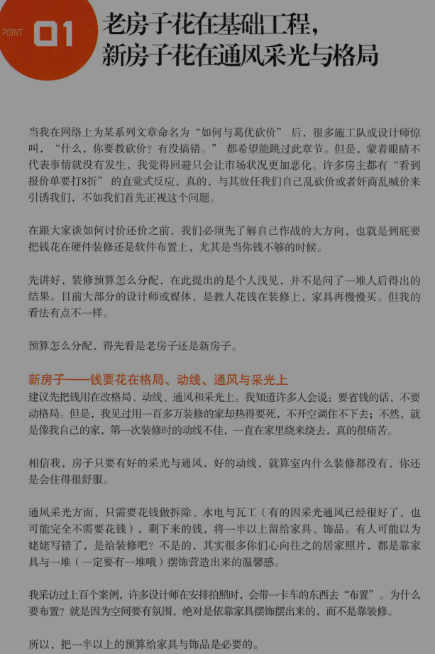
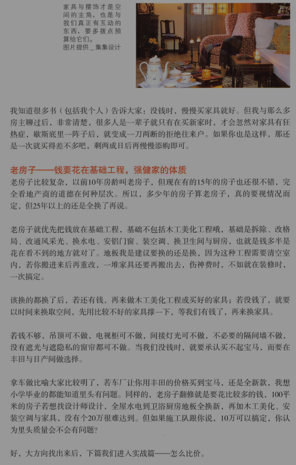
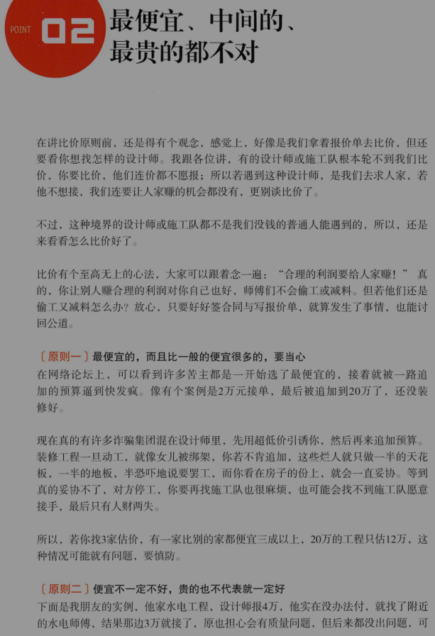
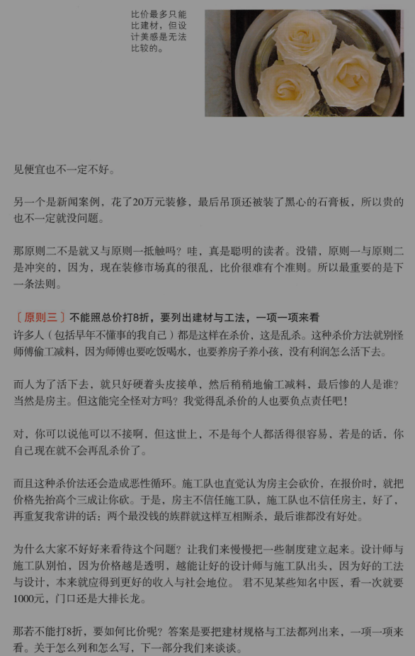
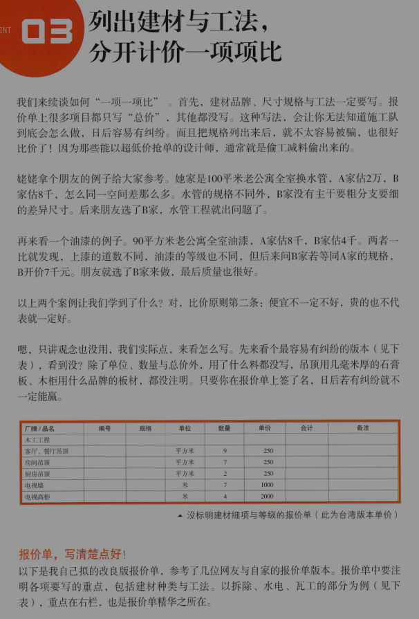
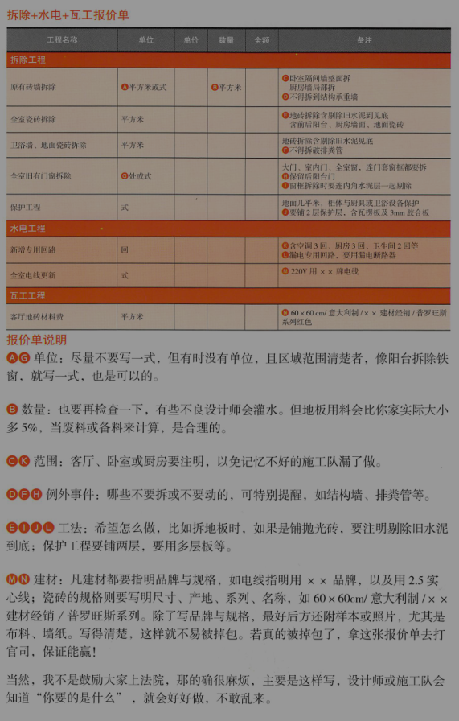
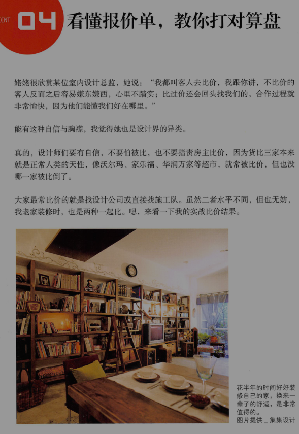
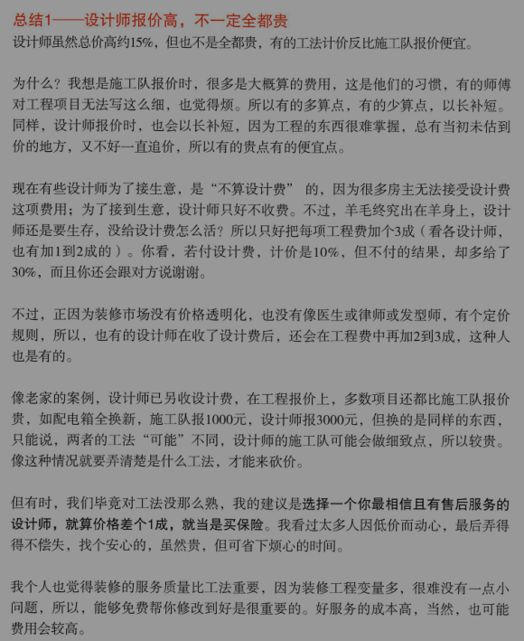
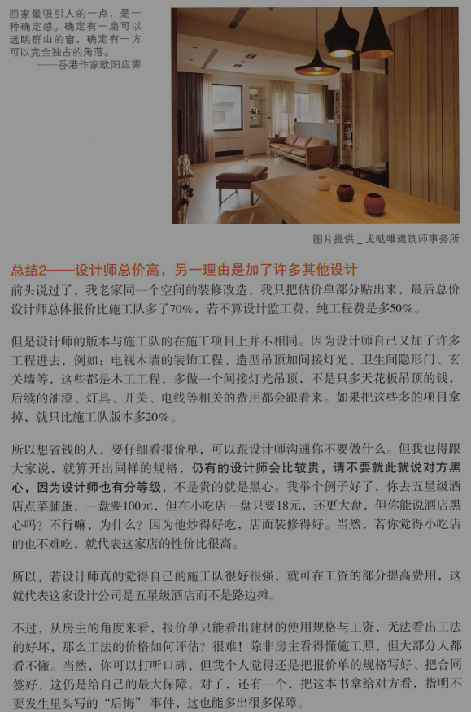
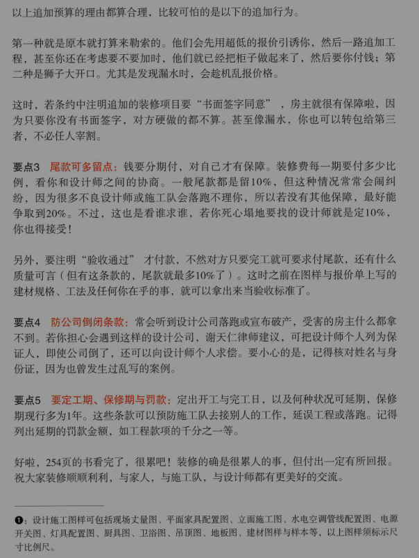

# 装修保命符：抓预算+拟合同

### 老房子花在基础工程，新房子花在通风采光与格局

### 最便宜，中间的，最贵的都不对

### 列出建材与工法，分开计价一项项比

### 看懂报价单，教你打对算盘

### 实战比价2大总结

总结1：设计师报价高，不一定全都贵

总结2：设计师总价高，另一个理由是加了许多其他设计

### 掌握5大要点签合同，守住你的家，你的钱

